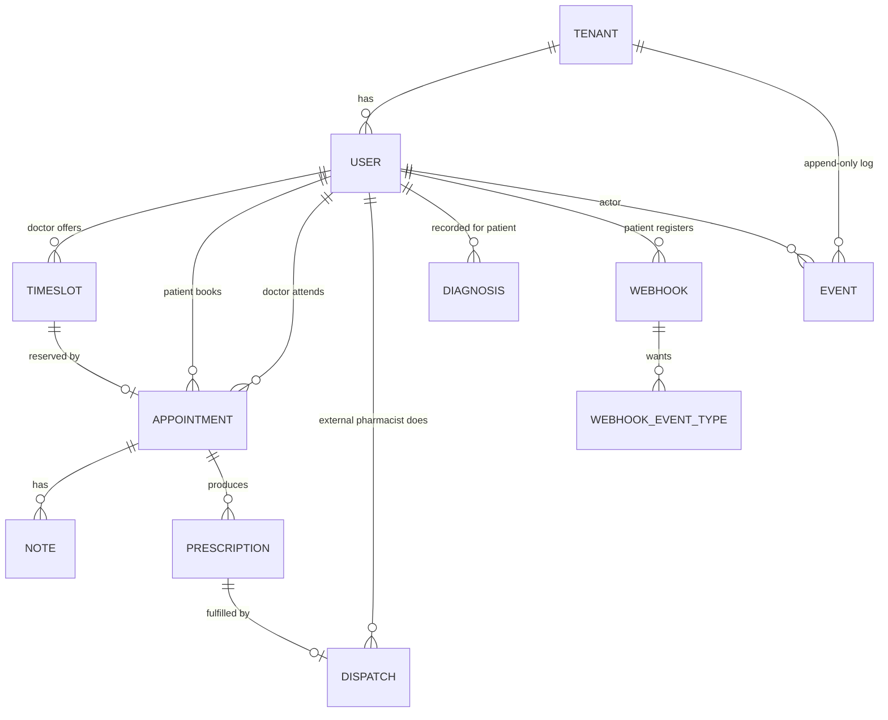

# medconnect — If we add a real database (explained simply)

> This document answers four questions about giving `medconnect` a real database
> instead of the in-memory maps it uses today:
>
> 1. **Which database** would we pick, and why (and why not the others)?
> 2. **What tables** would we create, what columns, and why? Is there any
>    **recursion** (like IMDB: *actor → movie → actor*)? Any **bridge/junction**
>    tables? What **algorithms** are involved?
> 3. **What is a "tenant"** in our code — a hospital? a location? (plus a plain-English
>    glossary).
> 4. If we use **CockroachDB**: is it an **RDBMS**? Does it use a **B-tree index**?
>    And what is the **primary key** of each table?
>
> The explanations are deliberately simple ("explain it like I'm five"), but the
> facts are real. Every example uses the **same cast of characters** so you can
> follow one story all the way through.

---

## The cast (one consistent example we reuse everywhere)

Two hospitals (so we can also show isolation):

| Hospital (tenant) | id | region |
|---|---|---|
| **Ada General Hospital** | `hosp-ada` | `eu-west` |
| **Bayview Clinic** | `hosp-bay` | `us-east` |

People inside **Ada General Hospital** (`hosp-ada`):

| Person | id | role |
|---|---|---|
| **Dr. Alice** | `doc-alice` | doctor |
| **Bob** (patient) | `pat-bob` | patient |

**Pia** the pharmacist does **not** work for the hospital. In Sweden (and most
places) pharmacies are **separate businesses out on the street** — there are many
of them, each with many pharmacists. Pia works at **Malmö Apotek** (`pharm-malmo`),
its own organization. She logs into the system and hands over a medicine **only if
a valid prescription exists**. (Why this matters for "tenants" is explained in §2.)

| Person | id | works at | role |
|---|---|---|---|
| **Pia** (pharmacist) | `pharm-pia` | Malmö Apotek (`pharm-malmo`) | pharmacist |

The one thing that happens in our story:

> Dr. Alice opens a **9–10 am slot**. Bob **books** it. Alice writes a **note** and
> a **prescription** (Aspirin). Pia **dispatches** the Aspirin. Alice records a
> **diagnosis** (Migraine). Bob has a **webhook** so his phone gets pinged.

We will put this exact story into database tables below.

---

## 0. TL;DR

- **Pick CockroachDB** (Postgres-compatible, distributed SQL). It gives us the two
  things our design already assumes: **real transactions** (for booking/dispatch
  invariants) and **easy scale-out across regions** (for many hospitals with many
  patients). You can even start on **plain PostgreSQL** and move later — the SQL is
  the same.
- **Tables** map almost 1:1 to the Go types we already have (`tenant`, `user`,
  `timeslot`, `appointment`, `note`, `prescription`, `diagnosis`, `webhook`,
  `event`, `dispatch`).
- **Yes, there is recursion**: a `user` is linked to another `user` through the
  `appointment` table (doctor ↔ patient). That is the same shape as IMDB
  *actor → movie → actor*.
- **Junction (bridge) tables**: `appointment` (links doctor + patient + timeslot)
  and `dispatch` (links prescription + pharmacist). One more small one:
  `webhook_event_type` (a webhook can want many event types).
- **A "tenant" is a whole hospital organization** (Ada General Hospital), not a
  single building or room. It is the "wall" that keeps one hospital's data away
  from another's.
- **Pharmacists are NOT part of a hospital.** They work at independent pharmacies
  (their own organizations). A prescription must be dispensable at **any** pharmacy,
  so prescriptions live in a **shared registry** that external pharmacists read —
  the dispatch step deliberately crosses the hospital wall (see §2.2).
- **CockroachDB is a real relational database (RDBMS)**. Its indexes are **sorted
  like a B-tree** (so range scans work), but under the floor it stores data in an
  **LSM-tree** engine — not a classic on-disk B-tree like PostgreSQL. Both behave
  "B-tree-like" for your queries.

---

## 1. Which database — and why not the others?

Our design already made two promises (see the spec and README):

1. **Invariants need a transaction.** "A patient may hold at most one appointment
   per doctor" and "a prescription is dispatched exactly once" are *check-then-act*
   rules. In memory we protect them with a mutex. In a database we need a real
   **transaction** that can check and write atomically.
2. **It must scale wide.** Many hospitals (tenants), some very large, spread across
   **regions**, with data-residency rules ("EU patient data stays in the EU").

**CockroachDB** fits both like a glove.

### Why CockroachDB (the short version, ELI5)

- It talks **SQL** and speaks the **PostgreSQL language**, so all our relational
  tables, joins, and transactions "just work."
- It is **distributed**: you add more machines and it spreads the data for you —
  no manual sharding.
- It can **pin data to a region** ("Bob's rows live in `eu-west`"), which is
  exactly our multi-region, data-residency requirement.
- It gives **SERIALIZABLE** transactions by default — the strongest safety — so our
  booking/dispatch invariants are guaranteed even with thousands of servers.

Think of it as **PostgreSQL that can grow into a giant** without a rewrite.

### Why not the others?

| Option | What it's great at | Why not *here* |
|---|---|---|
| **PostgreSQL** (plain) | Rock-solid single-region SQL, transactions, joins. | Perfect to **start** with (same SQL as Cockroach). But scaling to *10 M users/tenant across regions* means **manual sharding** + custom geo-partitioning. Cockroach does that natively. **Verdict: great stepping-stone, migrate later.** |
| **MySQL / MariaDB** | Popular, fast reads. | Similar single-node ceiling to Postgres; weaker fit for geo-distribution; we lose nothing by preferring the Postgres line, which Cockroach extends. |
| **MongoDB** (document) | Flexible JSON documents, easy to start. | Our data is **highly relational** (appointments join users, timeslots, notes, prescriptions). Cross-document transactions and joins are second-class here; our booking invariant across two "collections" is awkward. |
| **DynamoDB / Cassandra** (wide-column NoSQL) | Massive scale, always-on. | Default **eventual consistency** and no easy **multi-row transactions / joins**. Our "check the slot **and** the patient, then write both" needs a real transaction. Fighting the tool. |
| **Redis** | Blazing in-memory cache/queue. | It's a **cache**, not a **system of record**. Great *next to* the DB (e.g., rate limits), not *as* the DB. |
| **SQLite** | Zero-setup, single file. | Single-machine only. Fine for tests, not for many hospitals at scale. |

**Bottom line:** the shape of our problem (relational + transactional + multi-region)
points straight at **distributed SQL**, and CockroachDB is the friendliest one
because it *is* PostgreSQL-compatible. Start on Postgres if you want; the adapter
behind our `Repository` interfaces is the only thing that changes.

---

## 2. What is a "tenant" here? (and a plain-English glossary)

### A tenant = one whole hospital organization

In our code, `domain.Tenant` is described as *"a hospital organization and the root
of all data isolation."* So:

- A **tenant is NOT a room, a floor, or a single clinic location.**
- A **tenant IS the whole hospital company/organization** — e.g. **Ada General
  Hospital** (`hosp-ada`). It *has* a `region` (like `eu-west`), but the region is
  just a property of the hospital, not the tenant itself.

**ELI5:** imagine an apartment building. **Multi-tenancy** means many families
(hospitals) live in the same building (our one running service), but each family
has its **own locked apartment** (their own data). Nobody can wander into another
family's apartment. The **key** to each apartment is the `tenant_id`.

Every single row in every table carries a `tenant_id`. Every query says "…and only
where `tenant_id = 'hosp-ada'`." That is how **Ada General Hospital** can never see
**Bayview Clinic's** patients, and vice-versa.

### 2.2 …but pharmacists live *outside* the hospital wall

Here is the real-world twist you must model correctly. A **doctor** and a
**patient** belong to a hospital. A **pharmacist does not.** A hospital **may or
may not** have its own in-house pharmacy — it is optional and not guaranteed — but
in general pharmacists are **independent**. In Malmö (and almost everywhere)
pharmacies are **separate shops on the street** — many pharmacies, many
pharmacists — and a patient can walk into **any** of them to collect a medicine.

So a pharmacist is **not** a `user` inside `hosp-ada`. Pia belongs to her own
organization, **Malmö Apotek** (`pharm-malmo`). This means the pharmacy is its own
kind of tenant, and the dispatch step has to **reach across** the hospital wall.

**How real systems solve this (and how we would):** the prescription is not kept
locked inside one hospital. It is published to a **shared prescription registry** —
in Sweden this is literally the national **e-recept** system run by
E-hälsomyndigheten. Any pharmacy queries that registry by patient, sees the active
prescription, and dispenses it. So:

- **Hospital tenant** (`hosp-ada`) owns: doctors, patients, appointments, notes,
  diagnoses — the clinical context.
- **Pharmacy** (`pharm-malmo`) owns: its pharmacists. It is a **different tenant**.
- **Prescriptions** are written by the hospital **and published to a shared
  registry** that external pharmacists can read and dispatch against. This is the
  one place we intentionally cross the tenant wall — by design, not by accident.

**ELI5:** the hospital is a locked apartment; the pharmacy is a *different*
apartment down the road. The prescription is like a **letter dropped into a shared
post office** (the national registry) — any pharmacy can pick it up and fulfil it,
but neither can wander into the other's private rooms.

> **What the current code does (a stated simplification).** To keep the 4-hour demo
> simple, the running server seeds the pharmacist as a `user` **inside** the tenant
> and scopes dispatch to that tenant. That is a shortcut, **not** the realistic
> model above. The clean version separates pharmacies into their own tenants and
> routes dispatch through the shared prescription registry — a change isolated to
> the prescription store/adapter, because dispatch already goes through the
> `Repository` seam.

### Glossary (simple words)

- **Tenant** — one hospital organization; the wall that separates data.
- **Multi-tenancy** — many hospitals sharing one service, each fully walled off.
- **Isolation** — the guarantee that one tenant can't see another's data.
- **Table** — a spreadsheet: rows (records) and columns (fields).
- **Column / attribute** — one field in a table (e.g. `status`).
- **Row / record** — one line in the table (e.g. Bob's appointment).
- **Primary key (PK)** — the unique "name tag" that identifies one row.
- **Foreign key (FK)** — a column that points at another table's primary key
  (a "see-that-row-over-there" arrow).
- **Junction / bridge table** — a table whose main job is to **connect** two other
  tables (a matchmaker).
- **Index** — a sorted lookup helper, like the index at the back of a book, so you
  don't read every page.
- **RDBMS** — Relational Database Management System: tables + relationships + SQL +
  transactions.
- **Transaction** — a group of changes that all happen together or not at all
  ("all-or-nothing").
- **ACID** — the promise a transaction keeps: **A**tomic, **C**onsistent,
  **I**solated, **D**urable.
- **Serializable** — the strongest isolation: results look as if transactions ran
  one-at-a-time in a line, never overlapping.

---

## 3. The tables — what, which columns, and why

Each table below matches a Go type we already have. Column names are shown in
`snake_case` (the SQL convention). **PK** = primary key, **FK** = foreign key.

> **Primary key choice (important):** in a distributed DB we use a **composite
> primary key `(tenant_id, id)`** on almost every table. Two reasons, both simple:
> (1) it keeps each hospital's rows **grouped together** on the same machines
> (fast, and easy to pin to a region); (2) it makes "only my tenant's data" the
> natural default. The `id` itself is a **random hex string** (from `crypto/rand`),
> which spreads writes evenly (more on that in §6).

### 3.1 `tenant` — the hospitals

| column | type | why |
|---|---|---|
| `id` **PK** | text | the hospital's id, e.g. `hosp-ada` |
| `region` | text | where its data should live, e.g. `eu-west` |
| `name` *(suggested)* | text | human label, e.g. "Ada General Hospital" |

```
id        | region  | name
----------+---------+----------------------
hosp-ada  | eu-west | Ada General Hospital
hosp-bay  | us-east | Bayview Clinic
```

### 3.2 `user` — doctors, patients, pharmacists

| column | type | why |
|---|---|---|
| `tenant_id` **PK, FK→tenant.id** | text | which hospital they belong to |
| `id` **PK** | text | the person's id, e.g. `doc-alice` |
| `role` | text | `doctor` \| `patient` \| `pharmacist` — decides what they may do |
| `name` | text | display name |

```
tenant_id | id         | role       | name
----------+------------+------------+-----------
hosp-ada  | doc-alice  | doctor     | Dr. Alice
hosp-ada  | pat-bob    | patient    | Bob
```

> **Pharmacists are not in this hospital's `user` table.** Pia lives under her
> pharmacy's tenant, e.g. `pharm-malmo | pharm-pia | pharmacist | Pia`. See §2.2 —
> she reaches the prescription through the shared registry, not through `hosp-ada`.

### 3.3 `timeslot` — a doctor's free time

| column | type | why |
|---|---|---|
| `tenant_id` **PK** | text | hospital |
| `id` **PK** | text | slot id, e.g. `slot-9` |
| `doctor_id` **FK→user.id** | text | whose availability |
| `start_at` | timestamptz | when it starts |
| `end_at` | timestamptz | when it ends |
| `status` | text | `open` \| `booked` |

```
tenant_id | id     | doctor_id | start_at            | end_at              | status
----------+--------+-----------+---------------------+---------------------+-------
hosp-ada  | slot-9 | doc-alice | 2027-03-01T09:00Z   | 2027-03-01T10:00Z   | booked
```

### 3.4 `appointment` — the booking (a **bridge table**, see §4)

| column | type | why |
|---|---|---|
| `tenant_id` **PK** | text | hospital |
| `id` **PK** | text | e.g. `appt-1` |
| `doctor_id` **FK→user.id** | text | the doctor |
| `patient_id` **FK→user.id** | text | the patient |
| `timeslot_id` **FK→timeslot.id** | text | which slot was taken |
| `start_at`, `end_at` | timestamptz | copied from the slot so the appointment carries its own time |
| `status` | text | `scheduled` \| `cancelled` \| `completed` |
| `created_at` | timestamptz | when it was booked |

```
tenant_id | id     | doctor_id | patient_id | timeslot_id | status    | created_at
----------+--------+-----------+------------+-------------+-----------+-----------
hosp-ada  | appt-1 | doc-alice | pat-bob    | slot-9      | scheduled | 2027-03-01T08:55Z
```

> A **UNIQUE** constraint on `(tenant_id, doctor_id, patient_id)` (for non-cancelled
> rows) is how the database enforces **"≤ 1 appointment per patient–doctor pair"** —
> the same rule our mutex enforces today.

### 3.5 `note` — clinical notes on an appointment

| column | type | why |
|---|---|---|
| `tenant_id` **PK** | text | hospital |
| `id` **PK** | text | `note-1` |
| `appointment_id` **FK→appointment.id** | text | which visit |
| `text` | text | the note body |
| `source` | text | `manual` \| `dictation` |
| `status` | text | `complete` \| `incomplete` (gap-aware transcription) |
| `missing` | int[] | which chunk numbers were lost (empty when complete) |
| `created_at` | timestamptz | ordering |

```
tenant_id | id     | appointment_id | source | status   | text
----------+--------+----------------+--------+----------+--------------------------
hosp-ada  | note-1 | appt-1         | manual | complete | Patient reports headache.
```

### 3.6 `prescription` — medicine orders

| column | type | why |
|---|---|---|
| `tenant_id` **PK** | text | hospital |
| `id` **PK** | text | `rx-1` |
| `appointment_id` **FK→appointment.id** | text | issued during which visit |
| `patient_id` **FK→user.id** | text | who it's for |
| `medication` | text | e.g. "Aspirin 100mg" |
| `issued_at`, `expires_at` | timestamptz | validity window |
| `dispatched_at` | timestamptz null | filled when a pharmacist dispatches |
| `status` | text | `active` \| `dispatched` \| `expired` |

> **Shared beyond the hospital.** Because an external pharmacy must be able to
> dispense it (§2.2), a prescription is published to a **shared registry** keyed by
> `patient_id`, not sealed inside the hospital tenant. The `tenant_id` here records
> *which hospital issued it*, but read/dispatch access is granted to external
> pharmacists too.

```
tenant_id | id   | appointment_id | patient_id | medication    | expires_at        | status
----------+------+----------------+------------+---------------+-------------------+----------
hosp-ada  | rx-1 | appt-1         | pat-bob    | Aspirin 100mg | 2027-04-01T00:00Z | dispatched
```

### 3.7 `dispatch` — proof a prescription was handed over (a **bridge table**)

| column | type | why |
|---|---|---|
| `tenant_id` **PK** | text | hospital that issued the prescription |
| `id` **PK** | text | `disp-1` |
| `prescription_id` **FK→prescription.id** | text | which medicine |
| `pharmacist_id` **FK→user.id** | text | who dispatched it — an **external** pharmacist (e.g. Pia at `pharm-malmo`), not a hospital user (§2.2) |
| `pharmacy_id` *(suggested)* | text | which pharmacy fulfilled it |
| `dispatched_at` | timestamptz | when |

```
tenant_id | id     | prescription_id | pharmacist_id | dispatched_at
----------+--------+-----------------+---------------+-------------------
hosp-ada  | disp-1 | rx-1            | pharm-pia     | 2027-03-01T10:05Z
```

### 3.8 `diagnosis` — diseases recorded for a patient

| column | type | why |
|---|---|---|
| `tenant_id` **PK** | text | hospital |
| `id` **PK** | text | `diag-1` |
| `patient_id` **FK→user.id** | text | the patient |
| `disease` | text | e.g. "Migraine" |
| `diagnosed_at` | timestamptz | when found |
| `dismissed_at` | timestamptz null | soft-close (keeps history; never hard-deleted) |

```
tenant_id | id     | patient_id | disease  | diagnosed_at      | dismissed_at
----------+--------+------------+----------+-------------------+-------------
hosp-ada  | diag-1 | pat-bob    | Migraine | 2027-03-01T10:02Z | (null)
```

### 3.9 `webhook` + `webhook_event_type` — Bob's live-update subscription

`webhook` is the subscription; `webhook_event_type` is a tiny **junction table**
because one webhook can want **many** event types.

`webhook`:

| column | type | why |
|---|---|---|
| `tenant_id` **PK** | text | hospital |
| `id` **PK** | text | `wh-1` |
| `patient_id` **FK→user.id** | text | who subscribed |
| `url` | text | where to POST |
| `secret` | text | to sign the POST (HMAC) |

`webhook_event_type` (junction — many event types per webhook):

| column | type |
|---|---|
| `tenant_id` **PK, FK** | text |
| `webhook_id` **PK, FK→webhook.id** | text |
| `event_type` **PK** | text |

```
webhook                                   webhook_event_type
id   | patient_id | url                    webhook_id | event_type
-----+------------+---------------------   -----------+--------------------
wh-1 | pat-bob    | https://bob/hook       wh-1       | note_added
                                           wh-1       | prescription_added
```

> Alternative: CockroachDB/Postgres support an **array column** (`event_types text[]`),
> which our Go code uses today. The junction table is the fully-normalized version
> and is nicer if you ever need to query "who subscribes to `note_added`?".

### 3.10 `event` — the append-only log (the heart of the system)

Every change writes one immutable row here. History, audit, and analytics are all
just **reads** of this table.

| column | type | why |
|---|---|---|
| `tenant_id` **PK** | text | hospital |
| `id` **PK** | text | `evt-1` |
| `type` | text | `appointment_booked`, `note_added`, … |
| `actor_id` **FK→user.id** | text | **who** did it (audit) |
| `entity_ref` | text | **what** it was about (e.g. `appt-1`) |
| `payload` | jsonb | extra details |
| `occurred_at` | timestamptz | **when** (audit + point-in-time) |

```
tenant_id | id    | type                    | actor_id  | entity_ref | occurred_at
----------+-------+-------------------------+-----------+------------+-------------------
hosp-ada  | evt-1 | appointment_booked      | pat-bob   | appt-1     | 2027-03-01T08:55Z
hosp-ada  | evt-2 | note_added              | doc-alice | appt-1     | 2027-03-01T10:01Z
hosp-ada  | evt-3 | prescription_added      | doc-alice | appt-1     | 2027-03-01T10:02Z
hosp-ada  | evt-4 | prescription_dispatched | pharm-pia | rx-1       | 2027-03-01T10:05Z
hosp-ada  | evt-5 | diagnosis_added         | doc-alice | diag-1     | 2027-03-01T10:02Z
```

---

## 4. Relationships, recursion, and bridge tables

### 4.1 The IMDB comparison — yes, we have the same recursion

In **IMDB**, an **actor** is connected to another **actor** *through* a **movie**:

```
actor  ──(acts in)──►  movie  ◄──(acts in)──  actor
                (junction: cast(movie_id, actor_id))
```

Both ends are the **same entity type** (`actor`), connected through a middle table.
That "connect a thing to another thing of the *same kind*" is a **self-referencing
many-to-many** — the recursion you asked about.

**We have exactly this shape.** In medconnect a **user (doctor)** is connected to
another **user (patient)** *through* an **appointment**:

```
user(doctor) ──(sees)──►  appointment  ◄──(books)── user(patient)
                (junction: appointment(doctor_id, patient_id, timeslot_id))
```

So the recursion is: **user → appointment → user**, the twin of **actor → movie →
actor**. The `user` table has **two foreign keys back into itself** (via the
appointment): `doctor_id` and `patient_id`.

> **One difference:** IMDB's `cast` junction is usually "pure" (just the two ids).
> Our `appointment` junction **also carries its own data** (status, times) — so it
> is both a **bridge** *and* a real entity in its own right. That's normal and
> common; it's called an **association entity**.

### 4.2 The bridge / junction tables we have

| Bridge table | Connects… | Extra data it carries |
|---|---|---|
| **`appointment`** | `user`(doctor) ↔ `user`(patient) ↔ `timeslot` | status, start/end, created_at |
| **`dispatch`** | `prescription` ↔ `user`(**external** pharmacist) | dispatched_at, pharmacy_id |
| **`webhook_event_type`** | `webhook` ↔ event-type list | (pure junction) |

Child tables (not bridges, just "belongs-to"): `note` and `prescription` belong to
an `appointment`; `diagnosis` belongs to a `patient`.

### 4.3 The picture



Notice `USER` connects to `APPOINTMENT` **twice** (once as doctor, once as
patient) — that double arrow is the recursion drawn out.

---

## 5. What algorithms are involved?

You don't write these yourself — the database does — but here's what's working for
us, in plain words.

- **Sorted (B-tree-style) indexes → fast lookups & ranges.** An index keeps rows in
  sorted order, like a phone book. "Find Bob's appointment" jumps straight there
  instead of scanning everything. Ranges too: "Dr. Alice's slots between 9 am and
  5 pm" is one quick sorted scan.
- **The booking / dispatch invariant → a serializable transaction.** The DB does
  *check-and-write* atomically: `BEGIN; SELECT the slot FOR UPDATE; if free, INSERT
  appointment + mark slot booked; COMMIT;`. Two people clicking "book" at once →
  one commits, the other is rejected. This is the **database version of our mutex**.
- **Consensus (Raft) → safety across machines.** CockroachDB copies each piece of
  data to 3 machines; a write only counts when a **majority agree**. ELI5: three
  friends must nod before it's written, so one friend fainting doesn't lose data.
- **Partitioning / partition pruning → keep a tenant's data together and local.**
  Because the key starts with `tenant_id` (and we can pin by `region`), Ada
  General's rows sit together in `eu-west`. Queries "prune" away everything that
  isn't this tenant.
- **Join algorithms → building the appointment overview.** "Appointment + its notes
  + its prescriptions" is a **join** of three tables. The engine picks a strategy:
  **lookup/index join** (use the FK index), **merge join** (both sides sorted), or
  **hash join** (build a hash table of one side). It chooses automatically.
- **Point-in-time overview → a range scan + fold.** "What did Bob's record look like
  on date T?" = read `event` rows where `occurred_at ≤ T` (a sorted range scan) and
  fold them into a snapshot.

---

## 6. Is CockroachDB an RDBMS? Does it use B-tree indexes? What are the primary keys?

### 6.1 Is it an RDBMS? — **Yes.**

CockroachDB is a **relational database (RDBMS)**: it has **tables**, **columns**,
**foreign keys**, **SQL**, and **ACID transactions**. It is also
**PostgreSQL-wire-compatible**, so Postgres tools and drivers work. The twist is
that it is **distributed** — it spreads those tables across many machines and
regions automatically. So: *"PostgreSQL you can grow into a cluster."*

### 6.2 Does it use B-tree indexes? — **Sorted like one; stored differently.**

This is the honest, precise answer:

- **Logically (what your queries see):** every index is **ordered/sorted**, exactly
  like a **B-tree**. That's why equality lookups and **range scans** ("9 am to 5 pm")
  are fast — the same behaviour you expect from a PostgreSQL B-tree index.
- **Physically (under the floor):** CockroachDB does **not** store a classic on-disk
  B-tree. It keeps everything as a giant **sorted key–value map** inside an
  **LSM-tree** storage engine called **Pebble** (a RocksDB-style engine). LSM-trees
  write to memory first and flush to sorted files, which is great for heavy writes.

So: **PostgreSQL uses real B-tree index files; CockroachDB uses an LSM engine but
exposes B-tree-*like* ordered indexes.** For *how you query*, treat them the same
(ranges and sorts are fast). For *how it's stored*, they differ.

**ELI5:** both give you a **sorted index at the back of the book** so you can find
things fast (that's the "B-tree-like" part). PostgreSQL keeps that index on real
index pages; CockroachDB keeps the whole book as sorted sticky-notes it tidies in
the background (that's the LSM part).

### 6.3 The primary key of each table

We recommend a **composite primary key `(tenant_id, id)`** on the main tables. Why:
it groups a hospital's rows together (locality + easy region pinning) and makes
tenant-scoping the natural default.

| Table | Primary key | Notes |
|---|---|---|
| `tenant` | `(id)` | the hospital id itself |
| `user` | `(tenant_id, id)` | a person within a hospital |
| `timeslot` | `(tenant_id, id)` | |
| `appointment` | `(tenant_id, id)` | + **UNIQUE** `(tenant_id, doctor_id, patient_id)` for the ≤1 rule |
| `note` | `(tenant_id, id)` | |
| `prescription` | `(tenant_id, id)` | |
| `dispatch` | `(tenant_id, id)` | + **UNIQUE** `(tenant_id, prescription_id)` = dispatch-exactly-once |
| `diagnosis` | `(tenant_id, id)` | |
| `webhook` | `(tenant_id, id)` | |
| `webhook_event_type` | `(tenant_id, webhook_id, event_type)` | pure junction: the PK **is** the three columns |
| `event` | `(tenant_id, id)` | |

**Why the `id` is a random string, not `1, 2, 3, …`:** in a distributed DB, keys
that increase in order (`1,2,3…`) make **everybody write to the same spot** — like a
whole crowd queueing at one checkout. A **random** id (our `crypto/rand` hex) spreads
writes across many "checkouts" (ranges) so no single machine gets hot. This is a
well-known CockroachDB best practice.

> **Uniqueness bonus:** the two `UNIQUE` constraints above let the **database itself**
> guarantee our two headline invariants — "one appointment per patient–doctor pair"
> and "dispatch exactly once" — even under heavy concurrency, replacing the
> in-memory mutex we use today.

---

## 7. How this connects back to our code (nothing rewritten)

Our services already talk to **`Repository` interfaces** (ports), not to the maps
directly. Adding CockroachDB means writing **one new adapter** that implements those
same interfaces with SQL — the business logic doesn't change:

```
today:   Service ──► Repository interface ──► in-memory map (mutex)
later:   Service ──► Repository interface ──► CockroachDB adapter (SQL transaction)
```

- The **mutex critical section** becomes a **SQL transaction** (`SELECT … FOR
  UPDATE` / serializable retry).
- Each **map** becomes a **table**.
- The **in-memory event slice** becomes the **`event` table** (append-only), written
  in the *same* transaction as the change it records — so history, audit, and
  analytics stay perfectly consistent.

That is the whole point of the hexagonal design: **the database is a drop-in
adapter, not a rewrite.**

---

## 8. One-screen summary

- **DB:** CockroachDB (distributed, Postgres-compatible, serializable, region-aware).
  Start on PostgreSQL if you like — same SQL.
- **Tenant:** a whole **hospital organization** (e.g. Ada General Hospital) for its
  doctors and patients; the wall that isolates data; every row carries `tenant_id`.
  **Pharmacies are separate tenants** — pharmacists are external, and reach
  prescriptions through a **shared registry** (§2.2), not through the hospital.
- **Tables:** one per entity we already model; `appointment` & `dispatch` are
  **bridge tables**; `webhook_event_type` is a small pure junction.
- **Recursion:** yes — **user → appointment → user** (doctor ↔ patient), the same
  self-referencing many-to-many as IMDB **actor → movie → actor**.
- **CockroachDB:** a real **RDBMS**; indexes are **B-tree-like (sorted)** but stored
  in an **LSM engine (Pebble)**; primary keys are **`(tenant_id, id)`** with random
  `id`s, plus `UNIQUE` constraints that enforce our invariants in the database.
