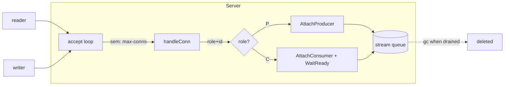

# Design, Decisions & Roadmap

A single reference for **what the system does**, **how it works**, the **choices we
made** (and why), the **choices we deliberately skipped**, and a **roadmap** for
robustness and scalability. It complements `specifications.md` (the full spec) and
`plan-multistream.md` (the multi-stream task plan); this document is the
narrative "why".

---

## 1. What the system is

A minimal, dependency-free message queue that copies files **byte-for-byte** over
a custom TCP protocol. It is split into three programs around an in-memory broker:

- **`reader`** (producer) — streams an input file to the broker as frames.
- **`server`** (broker) — buffers frames in a bounded FIFO and routes them.
- **`writer`** (consumer) — reads frames from the broker and reconstructs the file.

**Hard constraints (from the assignment):** Go standard library only — zero
external `require`s; never load a whole file into memory; the output must be a
byte-identical copy; `go test -race` must stay clean.

```
┌──────────┐   frames   ┌────────────────────┐   frames   ┌──────────┐
│  reader  │ ─────────▶ │      server        │ ─────────▶ │  writer  │
│ (produce)│   TCP      │ per-stream FIFO(s) │   TCP      │ (consume)│
└──────────┘            └────────────────────┘            └──────────┘
   reads file              bounded buffer +                 writes file
   in 32 KiB chunks        backpressure                     + fsync
```

---

## 2. How it works

### 2.1 Wire protocol (`internal/wire`)

Every message is a **length-prefixed frame**: a 4-byte big-endian `uint32` length
(`HeaderSize = 4`) followed by exactly that many opaque payload bytes. Payloads
are never inspected or transformed — that is what makes a byte-identical copy
possible.

- `MaxFrameSize = 65535` — the declared length is validated **before** any buffer
  is allocated, so a malformed/hostile length can never trigger a huge allocation.
- Zero-length frames are rejected (`ErrEmptyFrame`) to keep validation
  unambiguous.

### 2.2 The copy path

1. `reader` reads the file in **32 KiB chunks** (`chunkSize`) and writes one frame
   per chunk — constant memory regardless of file size.
2. `server` pushes each frame into the stream's bounded FIFO; a full queue
   **blocks the push**, which back-pressures the producer's TCP socket (lossless
   flow control).
3. `writer` pops frames in order, appends raw payloads, then **flushes and
   `fsync`s** so the on-disk copy is durable before exit.

### 2.3 Multi-stream model (the main extension)

One broker can carry many independent file copies at once (e.g. one stream per
phone call) without interleaving. A single shared FIFO would mix frames from
different producers and corrupt every output; instead each **stream id** gets its
own queue.

**Connection handshake** — the frame format is unchanged. Each connection declares
its identity once, right after connecting:

```
[role byte 'P'|'C']  →  [StreamID frame]  →  [data frames...]
```

- **StreamID** is validated as a token: 1–64 bytes (`MaxIDSize = 64`) from
  `[A-Za-z0-9._-]`. Restricting the charset keeps ids safe to log and to use as
  map keys / future filenames.
- Because each TCP connection carries exactly one stream, per-connection identity
  is sufficient and cheaper than a per-frame `StreamID` header.

**Registry (`internal/broker`)** — a `map[StreamID]*queue.Queue` behind a mutex:

- **One producer and one consumer per stream** (`ErrProducerExists` /
  `ErrConsumerExists`).
- A stream is created on first attach (producer or consumer — either may arrive
  first) and **garbage-collected** only once its producer has detached **and** its
  consumer has drained every buffered frame. A late consumer never loses data, and
  a global shutdown can never truncate another stream.
- `maxStreams` caps the number of live streams.
- `WaitReady` + an **attach timeout** bound how long a consumer waits for an absent
  producer instead of blocking forever.



### 2.4 Bounded queue (`internal/queue`)

A capacity-bounded, blocking, closeable FIFO (`queueCapacity = 1024` frames per
stream). `Pop` drains buffered frames before observing closure, so closing never
drops data. `Push` after `Close` returns `ErrClosed` **deterministically** (a
prioritized non-blocking check of the closing channel, so a closed-but-not-full
queue can't randomly accept a late frame).

### 2.5 Operational flags

| Program | Flag | Default | Purpose |
|---|---|---|---|
| server | `-addr` | `127.0.0.1:4000` | listen address (loopback by default) |
| server | `-idle` | `30s` | rolling read/write deadline; `0` disables |
| server | `-max-streams` | `256` | concurrent stream cap; `0` = unlimited |
| server | `-max-conns` | `1024` | concurrent connection cap; `0` = unlimited |
| server | `-attach-timeout` | `10s` | consumer wait for an absent producer; `0` = forever |
| reader | `-in`, `-addr`, `-stream` | — / `localhost:4000` / `default` | input file, broker, stream id |
| writer | `-out`, `-addr`, `-stream` | — / `localhost:4000` / `default` | output file, broker, stream id |

---

## 3. Choices we made (and why)

| Decision | Rationale | Trade-off accepted |
|---|---|---|
| **Length-prefixed binary framing** | Exact byte boundaries; no delimiter escaping; payloads stay opaque → byte-perfect copies | Must read the full frame before acting (fine for a copy) |
| **Validate length before allocating** | Prevents a hostile length prefix from forcing a huge allocation (memory-bomb) | Hard `MaxFrameSize` ceiling per frame |
| **Bounded FIFO + blocking backpressure** | Flat, predictable memory; lossless flow control for stored files | A stalled consumer slows its producer (correct for files) |
| **Stream the file in 32 KiB chunks** | Constant memory for any file size; balances syscalls vs. latency | Many small frames for large files (acceptable) |
| **`fsync` before writer exit** | The on-disk copy is durable, not just buffered | Slightly slower completion |
| **Per-connection role+id handshake** (not per-frame id) | One stream per connection → cheaper, frame format untouched, backward compatible | Can't multiplex multiple streams on one socket |
| **Per-stream queue in a registry** | Isolation: streams never interleave or truncate one another | A map + mutex + lifecycle bookkeeping |
| **Single producer + single consumer per stream** | Matches the real use case (one file in, one file out); symmetric, simple invariants | No fan-in / fan-out (see §4) |
| **Ref-counted GC of streams** | Map stays bounded; late consumers still drain | Slightly more lifecycle state |
| **Default bind to `127.0.0.1`** | Not exposed to the network by default (secure default) | Operator must opt in to a routable bind |
| **Rolling idle read/write deadlines** | Drops slowloris (read) and slow-read (write) stalls without cutting off progressing connections | A very slow but legitimate link could be dropped |
| **`-max-conns` / `-max-streams` caps** | Bounds goroutines, FDs, and memory under load | Excess connections block/are rejected |
| **Per-connection panic recovery** | One bad connection can't take down the accept loop | Recovered panics are logged, not escalated |
| **Stdlib-only, zero deps** | Assignment constraint; minimal supply-chain surface (`govulncheck` clean) | We hand-roll framing/registry instead of using a library |
| **Default stream `"default"`** | The original single-stream pipeline and its tests work unchanged | A magic default id |

---

## 4. Choices we deliberately skipped (and why)

These were considered and **intentionally left out** to keep the assignment
proportionate. Each is a clean future extension, not a rewrite.

| Skipped | Why it was out of scope | What it would take to add |
|---|---|---|
| **Fan-out / broadcast** (many consumers per stream) | Not the file-copy use case; doubles lifecycle complexity | Replace the single-consumer rule with a subscriber set + per-subscriber cursors |
| **Work-queue / load-balancing** (many consumers sharing one stream) | Same; needs partitioning/ack semantics | Competing consumers + at-least-once delivery + acks |
| **Per-frame multiplexing** (many streams on one socket) | Per-connection identity is simpler and enough | Add a `StreamID` to each frame header + a demux layer |
| **Authentication / authorization** | Acceptable for a loopback dev tool | Shared-secret or mTLS handshake before the role byte |
| **Persistence / write-ahead log** | Core is in-memory by design; durability is per-file `fsync` on the consumer | Append frames to a per-stream WAL; replay on restart |
| **Client-side distinction of "empty file" vs "no producer"** | Both yield zero frames; the writer exits 0 either way | An explicit end-of-stream / error control frame |
| **Reconnection / resume** | One-shot copy; restart re-runs it | Offsets + idempotent resume + dedupe |
| **Compression / encryption on the wire** | Payloads must stay byte-identical; out of scope | Negotiated codec layer around the payload (kept reversible) |
| **Backpressure tuning per stream** | One global `queueCapacity` is predictable | Per-stream capacity config |
| **Goroutine-count leak assertion in tests** | Registry `Len()→0` + `-race` already prove cleanup | A goroutine-count stability test (can be flaky) |

> **Notable deviation:** the plan originally called for the **writer** to exit
> non-zero when no producer exists. We put the timeout **server-side**
> (`-attach-timeout`) because that is where the blocking/leak actually is; the
> writer exits 0 with an empty output. Distinguishing the two cases on the client
> needs the end-of-stream control frame above.

---

## 5. Robustness & hardening already in place

- **Input validation at the boundary:** frame length bounded before allocation;
  stream id validated as a bounded token; role byte validated.
- **DoS bounds:** `-idle` (slowloris + slow-read), `-max-conns` (goroutine/FD
  flood), `-max-streams` (registry growth), `-attach-timeout` (consumer leak).
- **Data integrity:** per-stream isolation; queue drains before close; `fsync` on
  the consumer; deterministic `Push`-after-`Close`.
- **Fault isolation:** per-connection panic recovery; graceful `SIGINT/SIGTERM`
  shutdown that closes queues so consumers finish cleanly.
- **Supply chain:** zero external deps; CI runs `gofmt`, `go vet`, `go test -race`,
  and `govulncheck` on every PR/push; tag-triggered cross-compiled releases.

---

## 6. Roadmap — making it more robust & scalable

### 6.1 Robustness / correctness
- **End-of-stream control frame** so a consumer can distinguish *complete*,
  *empty*, and *producer-failed*, and exit with a meaningful status.
- **Write-ahead log per stream** for crash recovery (the spec's noted extension):
  durability beyond the consumer's `fsync`.
- **Heartbeats / keepalives** to detect half-open TCP connections faster than the
  idle timeout.
- **Checksums per frame or per stream** (e.g. CRC32/sha256) to detect corruption
  end-to-end, not just rely on TCP.

### 6.2 Scalability
- **Horizontal sharding (Kafka topic/partition model):** treat each stream as a
  partition; a broker fleet shards partitions across machines via consistent
  hashing. Stateless framing makes brokers scale horizontally by partition.
- **Per-frame multiplexing** so one connection can carry many streams (fewer
  sockets at very high stream counts).
- **Configurable / adaptive queue capacity** and a memory budget across all
  streams, rather than a fixed `maxStreams × queueCapacity × MaxFrameSize` ceiling.
- **Zero-copy / buffer pooling** (`sync.Pool` + a ring buffer) to cut per-frame GC
  churn at high throughput.

### 6.3 Observability & operability
- **Structured logs + metrics** (frames in/out, queue depth, drops, reconnects,
  live stream count) exposed via `expvar` / `net/http/pprof` (stdlib).
- **Health/readiness endpoints** for orchestration.
- **Tracing** of a frame's path for latency debugging.

### 6.4 Security (for any non-loopback deployment)
- **Authn/authz** before the role byte (shared secret or mTLS); keep the loopback
  default.
- **TLS** for confidentiality/integrity on untrusted networks.
- **Per-client rate limiting** in addition to the global caps.

### 6.5 Delivery & process
- Enable **branch protection** (require the `ci` check; block force-push to `main`).
- Add **integration/E2E in CI** for the multi-stream path under load.
- **Feature-flag** risky new delivery modes (broadcast/work-queue) so they ship
  dark and roll out gradually.

---

## 7. Known limitations (today)

- In-memory only — a broker restart loses buffered frames (by design).
- Single broker process — no built-in clustering or failover yet.
- No authentication — safe only on a trusted/loopback network.
- Worst-case buffered memory is `maxStreams × queueCapacity × MaxFrameSize`
  (≈ 16 GiB at defaults) if many producers fill queues with no consumers; bounded
  and predictable, but tune the defaults for small instances.
- A consumer cannot tell an empty source file from a missing producer.

---

## 8. Decision log (commit map)

| Area | Commit subject |
|---|---|
| Stream-id codec | `feat(wire): add validated stream-id handshake codec` |
| Registry | `feat(broker): add per-stream registry with ref-counted lifecycle` |
| Routing | `feat: route connections by stream id via the registry` |
| Integration tests | `test: cover multi-stream isolation and consumer attach timeout` |
| Spec | `docs: mark multi-stream as implemented in spec 11.3` |
| Queue race | `fix(queue): reject Push deterministically after Close` |
| Slow-read DoS | `harden(server): bound the consumer write path with a deadline` |
| Connection flood | `harden(server): cap concurrent connections with -max-conns` |
| CI | `ci: add quality-gate pipeline with govulncheck security gate` |
| Release/CD | `ci: add tag-triggered release pipeline and Dependabot` |
