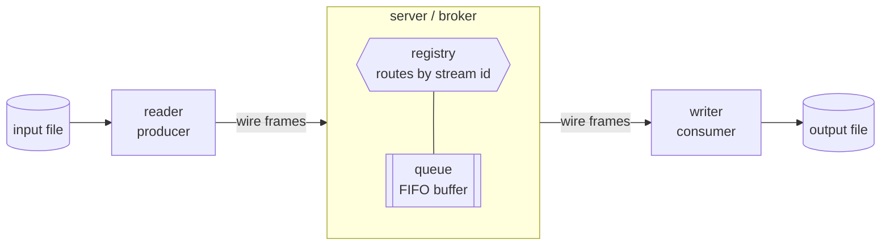
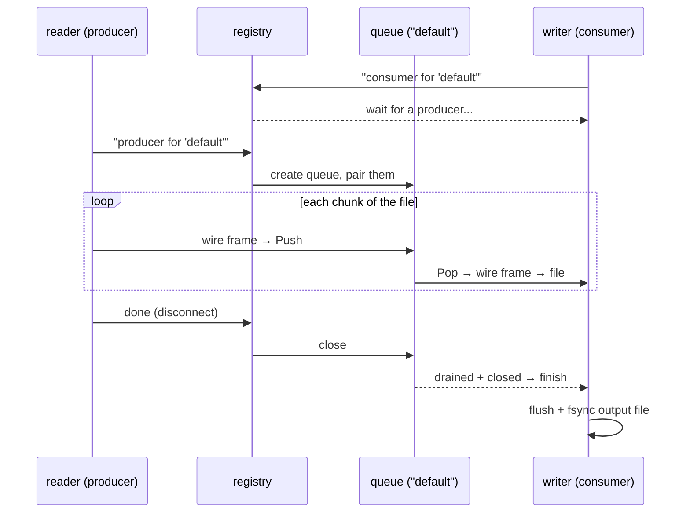

# How the Pieces Fit: `wire`, `queue`, and `registry`

This system does one simple thing: **copy a file from one place to another over the
network, byte-for-byte**. A `reader` sends a file in, a `server` (broker) holds it
briefly, and a `writer` saves it out.

Three small building blocks make that work. Here they are in plain language, with a
postal-service analogy:

| Package | Plain-English role | Postal analogy |
|---------|--------------------|----------------|
| `internal/wire` | The **packaging rules** — how bytes are wrapped so both sides agree where one message ends and the next begins. | Envelopes + the address label on each one. |
| `internal/queue` | The **waiting line** — an in-memory buffer that holds messages in order between sender and receiver. | The mail tray that fills and empties. |
| `internal/broker` (registry) | The **switchboard** — matches the right sender to the right receiver using a *stream id*. | The sorting office that routes mail to the correct tray. |

## Big picture



- **`wire`** is used on both arrows (the format of the bytes travelling over TCP).
- **`registry`** lives inside the server and decides *which* queue a connection belongs to.
- **`queue`** is the buffer in the middle that decouples the fast sender from the slower receiver.

---

## 1. `wire` — the packaging rules

TCP is just a stream of bytes with no built-in "message" boundaries. If the reader
sends `hello` then `world`, the writer might receive `hellowor` then `ld` — it can't
tell where one chunk ends. `wire` fixes this by putting a **length in front of every
chunk** (this is called *framing*).

**One frame on the wire:**

```
┌──────────────────────┬───────────────────────────────┐
│  4-byte length (N)    │      N bytes of payload        │
│  big-endian uint32    │      (opaque — never changed)  │
└──────────────────────┴───────────────────────────────┘
```

The receiver reads exactly 4 bytes to learn the size, then reads exactly that many
bytes — so it always knows where each message stops. The payload is treated as
**opaque bytes** (never parsed or modified), which is what makes the copy
byte-identical for any file, text or binary.

`wire` also defines the tiny **handshake** at the start of each connection so the
server knows who is calling:

```
[ role byte 'P' or 'C' ]  [ stream-id frame, e.g. "default" ]  [ server ack 'K'/'X' ]  [ data frames... ]
        who am I?                which stream?                       am I accepted?           the actual bytes
```

The **server ack** is the broker's one-byte yes/no: `'K'` means "you're attached,
go ahead"; `'X'` means "this stream is taken" (or the broker is full), so the
client stops immediately instead of streaming to no one.

> In short: **`wire` is the shared language** that lets the reader, server, and writer
> agree on what a "message" is.

---

## 2. `queue` — the waiting line

Once the server unpacks a frame, it drops the payload into a `queue`: a **bounded,
in-order, first-in-first-out (FIFO) buffer**.

```
   Push (producer)                              Pop (consumer)
        │                                            ▲
        ▼                                            │
     ┌─────┬─────┬─────┬─────┬─────┐   ...   ┌─────┐
     │  f5 │  f4 │  f3 │  f2 │  f1 │  ─────►  │ out │
     └─────┴─────┴─────┴─────┴─────┘         └─────┘
        newest                oldest
     (fixed capacity, e.g. 1024 frames)
```

It does three important jobs:

- **Order** — frames come out in exactly the order they went in.
- **Decoupling** — the reader can push while the writer pops; they don't have to move
  in lockstep.
- **Backpressure** — the buffer has a *fixed size*. When it fills up, `Push` **blocks**,
  which stalls the reader's TCP socket instead of letting memory grow without limit.
  When it drains, the reader resumes automatically.

When the producer is done, the queue is **closed**. The consumer keeps popping any
remaining frames, and once it's empty *and* closed, `Pop` reports "no more" so the
writer knows to finish.

> In short: **`queue` is the buffer in the middle** that holds bytes safely and in
> order while they wait to be written.

---

## 3. `registry` — the switchboard

A single server can carry **many independent streams at once** (e.g. `default`,
`images`, `logs`). The `registry` keeps one queue per stream id and connects the
matching producer and consumer:

```
            registry (map of stream id → queue)
        ┌───────────────────────────────────────────┐
        │  "default" ─► [ queue ]  ◄── 1 consumer    │
        │     ▲                                       │
        │  1 producer                                 │
        │                                             │
        │  "images"  ─► [ queue ]  ◄── 1 consumer    │
        │     ▲                                       │
        │  1 producer                                 │
        └───────────────────────────────────────────┘
```

Its responsibilities:

- **Routing** — when a connection says "I'm a producer for `images`", the registry
  hands it the `images` queue (creating it if needed).
- **One-to-one rule** — each stream allows **exactly one producer and one consumer**.
  A second producer on the same id is rejected (this is what you saw with two readers
  on `default`).
- **Readiness** — a consumer that connects first can *wait* a bounded time for its
  producer to show up (`-attach-timeout`).
- **Cleanup** — once both ends detach and the stream has been consumed, the registry
  **garbage-collects** that queue so memory is reclaimed.

> In short: **`registry` is the matchmaker/sorter** that keeps streams separate and
> pairs each sender with the right receiver.

---

## Putting it together: one file's journey



1. `wire` defines how every chunk is wrapped and the opening handshake.
2. `registry` reads the handshake, picks the right `queue`, and enforces one
   producer + one consumer per stream — a rejected client gets a busy ack and
   stops instead of dropping data.
3. `queue` buffers the chunks in order, applying backpressure so memory stays flat.
4. The writer pops until the stream is closed and drained, then fsyncs the file.

Each piece has a single, clear job — together they make a reliable, byte-exact file
copy over the network.
