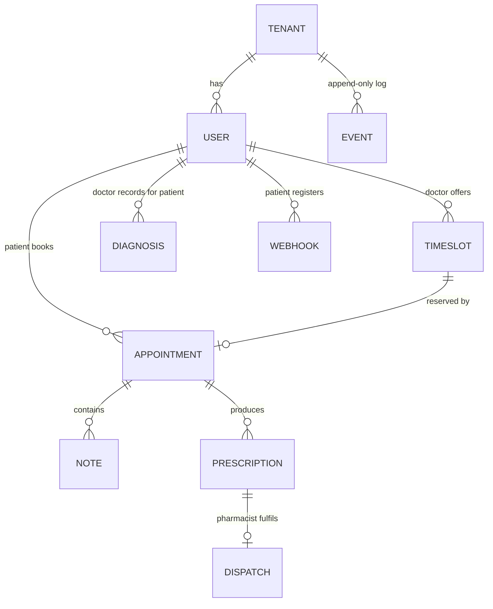
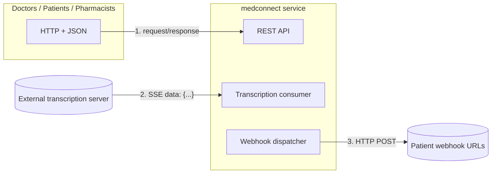
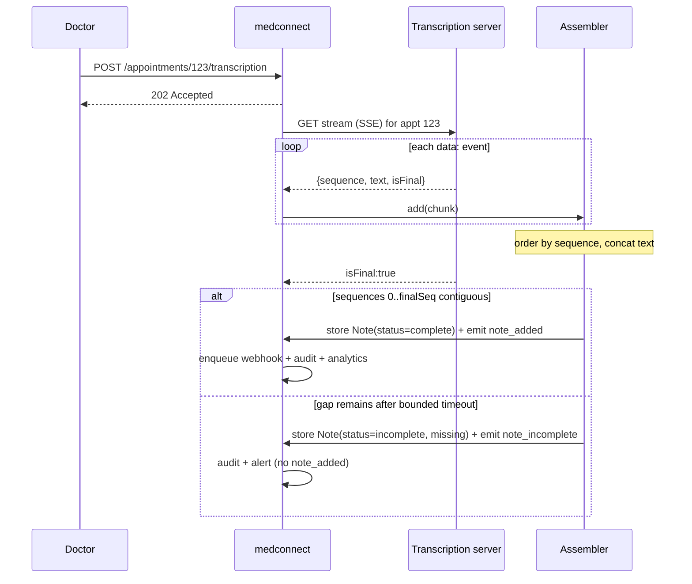
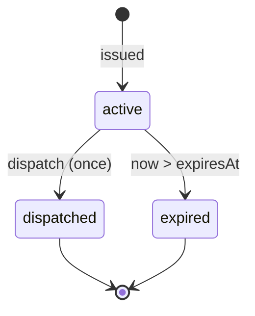

# Spec: `medconnect` — A Healthcare Appointment Management Service

> **Assignment:** Build a healthcare appointment management service in Go that
> connects doctors and patients. Patients book and manage appointments; doctors
> keep notes, issue prescriptions, and communicate with patients. See
> [Question.md](Question.md) for the full brief.
>
> **Context:** Corti technical assessment, ~4-hour budget. The brief explicitly
> says *"we don't expect all features to be fully implemented, consider them when
> designing your solution to ensure it can accommodate future requirements."* So
> this spec does two jobs at once:
> 1. **Specifies all 8 feature areas** as one coherent architecture.
> 2. **Isolates a buildable core** (clearly marked ⭐) that a single engineer can
>    realistically land in 4 hours, with every other feature reachable from the
>    same design without rework.
>
> This is a **separate service** from the existing `filequeue` module. It reuses
> two *ideas* from that codebase — a **bounded queue** and **TCP-style
> backpressure** — for asynchronous webhook delivery, but shares no code.

---

## 0. TL;DR — the decisions that matter

If you read nothing else, read this. The choices below are the ones that
determine whether this fits in 4 hours *and* whether the clinical data stays safe.

1. **Transport: REST + SSE + outbound webhooks** (not WebSocket, not gRPC).
   Justified in detail in [§4](#4-transport-decision--the-most-important-choice).
   The short version: the transcription server *already* emits `data: {...}`
   lines — that **is** Server-Sent Events — so consuming it is a `bufio.Scanner`
   loop with zero libraries. Webhooks are just `http.Post`. Both make us an HTTP
   *client*, never a streaming *server*, which is what saves the time.

2. **One append-only event log unifies three features.** Every state change is
   recorded as an immutable, timestamped event. That single structure delivers
   **Historical Overview** (fold events up to time *T*), **Audit Trail** (each
   event already carries *who* + *when*), and **Usage Analytics** (aggregate the
   log). Build the log once; get three features.

3. **In-memory stores behind interfaces.** The core persists to Go maps hidden
   behind `Repository` interfaces. Swapping to Postgres/CockroachDB later is an
   adapter, not a rewrite. This keeps the core dependency-light and testable in
   memory.

4. **Concurrency: mutex + one critical section per invariant** (not an
   actor/channel model). Shared maps are guarded by `sync.RWMutex`; cross-aggregate
   invariants (booking, dispatch) do their check-and-set inside a *single* locked
   section so two racers can never both win. Why not actors? The service **must be
   stateless** to scale to 10 M users across regions (§5.8), which means the real
   concurrency authority is the **DB transaction**, and an in-memory mutex is a
   1:1 stand-in for one (`SELECT … FOR UPDATE` / serializable). An
   actor-per-aggregate model implies single-process *stateful* ownership, which
   contradicts stateless scaling and would have to be undone later. The mutex is
   simpler, synchronous, and `go test -race`-provable. See
   [§4.7](#47-concurrency-model--why-mutex-not-actors).

5. **Transcription assembler: ordered, gap-aware, bounded-wait, explicitly
   incomplete.** A clinical note with a missing middle chunk can *invert meaning*
   (drop "not" from "does **not** report chest pain"), so we **never** silently
   finalize over a gap, and we **never** wait forever. A note is marked `complete`
   only when sequences `0..finalSeq` are contiguous; if gaps remain at `isFinal`
   plus a bounded timeout, it is stored `incomplete` (with the missing sequence
   numbers) and raises a `note_incomplete` event instead of a `note_added`. This is
   both deterministic (every path terminates) and safe (no silent corruption). See
   [§5.2](#52-notes-streaming--feature-2).

---

## 1. Objective

Build an HTTP service where:

- **Patients** can see a doctor's available timeslots, book **at most one**
  appointment with a given doctor, register a webhook to receive live updates, and
  view a full appointment overview (notes + prescriptions) and a point-in-time
  clinical overview.
- **Doctors** can publish available timeslots, see their next appointments, add
  notes (manually **and** by live dictation transcribed from an external stream),
  issue follow-up prescriptions, and diagnose / dismiss diseases.
- **Pharmacists** can dispatch medicines against *active* prescriptions.
- **Hospital organizations (tenants)** are isolated from one another, can scale
  independently, and can query usage analytics.

**Success looks like** (core): a doctor registers a timeslot → a patient books it
→ the doctor starts transcription → note chunks stream in over SSE, are reassembled
in `sequence` order, and stored → the patient's registered webhook receives a
`note_added` POST → a follow-up prescription is issued → a pharmacist dispatches it
exactly once → the appointment overview and the patient's point-in-time overview
both reflect every change → every change appears in the audit trail. All of this
scoped to a single tenant, with `go test -race` clean.

### Acceptance criteria (core ⭐)

1. **Booking invariant:** a patient cannot hold more than one appointment with the
   same doctor; a timeslot cannot be double-booked. Concurrent booking attempts
   resolve to exactly one winner (`go test -race`).
2. **Transcription ordering:** given chunks delivered out of order or with gaps,
   the stored note is the correctly ordered concatenation of `text`, finalized
   when `isFinal:true` arrives. Duplicate sequences are idempotent.
3. **Webhook delivery:** a `note_added` / `prescription_added` event produces an
   HTTP POST to every subscribed URL with the exact payload schema from the brief;
   a slow/failing subscriber never blocks the request path (async, bounded queue,
   retries with backoff).
4. **Dispatch exactly-once:** two concurrent dispatch calls on the same active
   prescription → one succeeds, one is rejected; the prescription ends
   `dispatched` and cannot be dispatched again.
5. **Point-in-time overview:** `GET /overview?at=T` returns diagnoses,
   active prescriptions, and appointments-with-notes **as they were at T**.
6. **Audit:** every mutation to patient data yields an audit record with actor,
   action, entity, and timestamp.
7. **Tenant isolation:** data created under tenant A is never visible to tenant B.

---

## 2. Tech Stack

- **Language:** Go 1.26 (new module, e.g. `module medconnect`).
- **Core dependencies:** **standard library only** — `net/http`, `encoding/json`,
  `bufio`, `context`, `sync`, `time`, `crypto/rand` (id generation), `log/slog`.
  This mirrors the house style of the existing repo and keeps the 4-hour core free
  of toolchain setup.
- **Production dependencies (design-only, not in the core):** a SQL driver +
  **PostgreSQL** or **CockroachDB** (the role explicitly mentions CockroachDB) for
  durable, geo-distributed, horizontally-scalable storage; optionally a message
  bus (Kafka/NATS) for cross-service events at scale.
- **Transport:** HTTP/1.1 + JSON for the client API; **SSE** (consumed as a
  client) for the transcription stream; **outbound HTTP POST** for webhooks. See
  [§4](#4-transport-decision--the-most-important-choice).

---

## 3. Domain Model

The whole system is a small set of entities, all scoped by `TenantID`.



| Entity | Key fields | Notes |
|--------|-----------|-------|
| **Tenant** | `id`, `region` | A hospital organization. Root of all isolation. |
| **User** | `id`, `tenantId`, `role` (doctor\|patient\|pharmacist), `name` | Role drives authorization. |
| **Timeslot** | `id`, `doctorId`, `start`, `end`, `status` (open\|booked) | Doctor availability. |
| **Appointment** | `id`, `doctorId`, `patientId`, `timeslotId`, `status` | Enforces "≤1 per patient-doctor pair". |
| **Note** | `id`, `appointmentId`, `text`, `source` (manual\|dictation), `status` (complete\|incomplete), `missing` (\[\]int), `createdAt` | Dictated notes assembled from stream chunks; `status`/`missing` capture gap-aware assembly (§5.2). Manual notes are always `complete`. |
| **Prescription** | `id`, `appointmentId`, `patientId`, `medication`, `issuedAt`, `expiresAt`, `status` (active\|dispatched\|expired) | State machine; dispatch is exactly-once. |
| **Diagnosis** | `id`, `patientId`, `disease`, `diagnosedAt`, `dismissedAt?` | Dismissal is a soft close (keeps history). |
| **Webhook** | `id`, `patientId`, `url`, `eventTypes[]`, `secret` | Patient subscription for live updates. |
| **Event** | `id`, `tenantId`, `type`, `actorId`, `entityRef`, `payload`, `timestamp` | **Append-only.** Powers history, audit, analytics. |
| **Dispatch** | `id`, `prescriptionId`, `pharmacistId`, `dispatchedAt` | Records fulfilment. |

### 3.1 The event log — one structure, three features

Every mutation appends an immutable `Event`. Nothing is ever updated in place in
the log. This gives us, for free:

- **Feature 4 (Historical Overview):** "state at time *T*" = fold all events with
  `timestamp ≤ T`. No temporal columns, no soft-delete gymnastics.
- **Feature 6 (Audit Trail):** every event already records `actorId` +
  `timestamp` + `entityRef`. The audit trail is a *view* over the log, not a
  second system to keep in sync.
- **Feature 7 (Usage Analytics):** counters (total appointments, active patients,
  prescription counts) are aggregations over the log, per `tenantId`.

> **Design note:** current entity tables (Appointment, Prescription, …) are a
> *read model / cache* projected from the log for fast lookups. In the 4-hour core
> we keep both the mutable maps *and* the append-only event slice in memory and
> write to both inside one mutex-guarded transaction. In production the log becomes
> the source of truth (event sourcing) or, more pragmatically, an append-only
> `events` table alongside normalized tables written in the same DB transaction.

---

## 4. Transport Decision — the most important choice

You asked, with a 4-hour budget, *what to choose and why, and how it affects the
solution.* Here is the full reasoning. There are **three distinct communication
channels**, and they should not all use the same protocol.

### 4.1 The three channels



| # | Channel | Direction | Our role | Recommended protocol |
|---|---------|-----------|----------|----------------------|
| 1 | Client API | client → us | **HTTP server** | **REST + JSON** |
| 2 | Transcription | external → us | **client (consumer)** | **SSE** |
| 3 | Live updates | us → patient | **client (sender)** | **outbound webhook (HTTP POST)** |

The crucial observation: **for streaming we are never the streaming *server*.** We
*consume* one stream and *send* many small POSTs. That is what makes 4 hours
feasible.

### 4.2 Channel 1 — client API: REST + JSON

- **Why:** `net/http` + `encoding/json` are stdlib, universally understood, and
  trivially testable with `curl` and `httptest`. Zero setup. Maps cleanly onto the
  CRUD-ish operations (book, list, add note, dispatch).
- **Cost:** minimal. This is the default; no alternative is worth considering for
  a 4-hour exercise.

### 4.3 Channel 2 — transcription: SSE (this is the key insight)

Look at the event format in the brief:

```
data: {"appointmentId": "123", "sequence": 0, "text": "chunk", "isFinal": false}
data: {"appointmentId": "123", "sequence": 1, "text": "final", "isFinal": true}
```

The `data: ` prefix, one JSON object per line, is **literally the Server-Sent
Events wire format** (`text/event-stream`). The brief has already chosen SSE for
us. Consuming it requires **no library**:

```go
// Sketch (design, not implementation): consume one SSE stream.
resp, _ := httpClient.Get(transcriptionURL) // long-lived response
sc := bufio.NewScanner(resp.Body)
for sc.Scan() {
    line := sc.Text()
    if strings.HasPrefix(line, "data:") {
        var chunk TranscriptChunk
        json.Unmarshal([]byte(strings.TrimSpace(line[5:])), &chunk)
        assembler.Add(chunk) // order by sequence, finalize on isFinal
    }
}
```

- **Why SSE over the alternatives here:**
  - **vs WebSocket:** WebSocket is *bidirectional*. Transcription is strictly
    *one-way* (server → us). We'd pay for the RFC 6455 handshake + frame
    masking/unmasking (or a third-party lib like `gorilla/websocket`) and gain
    nothing. Wrong tool.
  - **vs gRPC streaming:** requires `.proto` files, the `protoc` toolchain, code
    generation, and a dependency. Excellent at scale for internal services, but
    the setup alone can eat an hour. Not for a 4-hour exercise.
  - **vs SSE:** a `bufio.Scanner` loop. Nothing to install. And it matches the
    given format exactly.
- **How it affects the solution:** each "start transcription" request spawns a
  background goroutine that owns one SSE connection and one *assembler* (a
  per-appointment buffer keyed by `sequence`). This is the natural place to reuse
  the `filequeue` mindset: ordered assembly + graceful completion on `isFinal`.

### 4.4 Channel 3 — live updates: outbound webhooks

- **Why:** the brief specifies *"the service sends HTTP POST requests to the
  registered webhook URL."* That's the design — we just implement it well.
- **The one thing to get right:** delivery must be **asynchronous and bounded**.
  A patient's webhook endpoint may be slow or down; that must **never** block the
  doctor's "add note" request. This is exactly the `filequeue` pattern reused:
  - a **bounded in-memory queue** of pending deliveries (buffered channel, fixed
    capacity — the same backpressure principle as the broker's FIFO);
  - a small pool of **delivery workers** doing `http.Post` with **timeout,
    retries, and exponential backoff + jitter**;
  - an **HMAC signature** header (`secret`) so subscribers can verify authenticity.
- **How it affects the solution:** event producers (note added, prescription
  added) just `enqueue(event)` and return immediately. Delivery is decoupled.

### 4.5 Streaming to the *doctor's* UI (extension, not core)

If a doctor's browser should watch notes appear live, expose our **own** SSE
endpoint (`GET /appointments/{id}/notes/stream`) that re-emits assembled chunks.
This is a natural extension because we're already SSE-native — but it is **not**
in the 4-hour core.

### 4.6 Summary table — what to build in 4 hours

| Channel | Build now (core ⭐) | Why |
|---------|--------------------|-----|
| REST API | ✅ | Stdlib, fast, testable |
| SSE consumer | ✅ | Matches given format, no deps, one scanner loop |
| Webhook sender (async, bounded, retry) | ✅ | Required by brief; reuses queue+backpressure pattern |
| WebSocket | ❌ | Bidirectional not needed; setup cost |
| gRPC | ❌ | Toolchain + codegen cost |
| Doctor-facing SSE re-broadcast | ❌ (extension) | Nice-to-have, not required |

### 4.7 Concurrency model — why mutex, not actors

The invariants that matter (a patient holds ≤1 appointment per doctor; a timeslot
isn't double-booked; a prescription is dispatched exactly once) are all
**check-then-act** races. Two candidate designs:

| | **Mutex + in-memory maps** *(chosen)* | **Actor / channel per aggregate** |
|---|---|---|
| Control flow | Synchronous call → result/error | Async message → reply channel |
| Multi-aggregate invariant (booking = timeslot **+** appointment) | One `sync.Mutex` wraps the whole check-and-set | Must coordinate two actors → reinvent a transaction/saga |
| Determinism & tests | Direct, `go test -race`-provable | Async; easy to write flaky tests |
| Maps to production | **1:1 with a DB transaction** (`SELECT … FOR UPDATE` / serializable) | Implies single-process *stateful* ownership |
| Fits stateless, multi-region, 10 M users (§5.8) | ✅ mutex is only a local stand-in for the DB txn | ❌ stateful ownership contradicts stateless scaling |
| Code cost in 4 h | Minimal | Mailboxes, routing, lifecycle/passivation |

**Decision:** mutex + in-memory maps, with the discipline of **one critical
section per invariant**, behind `Repository` interfaces. Because the service must
be **stateless** to scale, the authoritative concurrency control in production is
the **database transaction**; the in-memory mutex is a faithful stand-in that a
SQL adapter later replaces without touching service logic. An actor model would be
elegant for a single-process *stateful* server — which this is not — and would have
to be undone to scale. The booking/dispatch tasks ship **with** their concurrency
`-race` tests (see plan Tasks 1.2 and 4.2).

---

## 5. Feature-by-Feature Specification

Legend: ⭐ = in the 4-hour buildable core · ◐ = partial/simplified in core ·
○ = design-only (structure in place, not implemented in 4 h).

### 5.1 Appointments Management ⭐ (Feature 1)

**Doctor**
- ⭐ Register available timeslots — `POST /v1/timeslots`.
- ⭐ See next appointments — `GET /v1/appointments/next` (sorted by start time,
  future only).
- ⭐ Add notes to an appointment — `POST /v1/appointments/{id}/notes`.
- ⭐ Make follow-up prescriptions — `POST /v1/appointments/{id}/prescriptions`.

**Patient**
- ⭐ See available timeslots for a doctor —
  `GET /v1/doctors/{doctorId}/timeslots?status=open`.
- ⭐ Book **up to one** appointment with a doctor — `POST /v1/appointments`.
  - **Invariant enforced under lock:** reject if the patient already holds an
    appointment with that doctor; reject if the timeslot is already booked. The
    check-and-set happens inside a single critical section so concurrent bookings
    cannot both win.

**Both**
- ⭐ Appointment overview with notes + prescriptions —
  `GET /v1/appointments/{id}`.

### 5.2 Notes Streaming ⭐ (Feature 2)

- ⭐ `POST /v1/appointments/{id}/transcription` — starts transcription. Returns
  `202 Accepted` immediately; work happens in the background.
- ⭐ Background worker: opens the SSE connection to the transcription server for
  that appointment, reads `data:` events, and hands each chunk to a per-appointment
  **assembler**.
- ⭐ **Assembler** — *ordered, gap-aware, bounded-wait, explicitly incomplete.* It
  buffers chunks and orders them by `sequence`. A note is **complete** only when
  every sequence in `[0, finalSeq]` is present (`finalSeq` is the sequence carrying
  `isFinal:true`).
  - **Out-of-order / duplicate:** buffered and tolerated; a duplicate `sequence`
    with identical text is idempotent, with *different* text is a protocol
    violation (flagged, never silently overwritten).
  - **Gap present at `isFinal` (or stream close):** wait up to a bounded timeout
    (missing chunks are usually just reordered in flight). If the gap persists,
    **do not** emit `note_added`. Store the note `status=incomplete` with the
    `missing` sequence numbers and emit a **`note_incomplete`** event (→ audit +
    alert) so the record is never presented as a finished clinical note.
  - **Complete:** persist `status=complete`, emit `note_added` (→ webhook + audit +
    analytics).
- **Why this policy:** a missing middle chunk can invert clinical meaning, so
  silently finalizing over a gap is unacceptable; waiting forever would hang the
  worker unpredictably. Bounded-wait + explicit `incomplete` is both **safe** (no
  silent corruption) and **deterministic** (every path terminates).
- **Robustness (◐ core / ○ prod):** in production, reconnect with backoff and
  resume — the same reliability story as `filequeue`'s reconnection extension.



### 5.3 Live Updates ⭐ (Feature 3)

- ⭐ `POST /v1/webhooks` — patient registers `{ url, eventTypes }`; server returns
  an id and a generated `secret`.
- ⭐ `DELETE /v1/webhooks/{id}` — unsubscribe.
- ⭐ On `note_added` / `prescription_added`, the dispatcher POSTs the exact
  payload from the brief:

```json
{
  "eventId": "unique-event-id",
  "eventType": "note_added",
  "timestamp": "2025-01-15T10:30:00Z",
  "appointmentId": "123",
  "patientId": "456",
  "data": { "noteId": "note-123", "noteText": "Patient reports..." }
}
```

- ⭐ Delivery is **async, bounded, retried** (see [§4.4](#44-channel-3--live-updates-outbound-webhooks)).
- ○ **At-least-once + idempotency:** include `eventId` so subscribers can
  de-duplicate; a dead-letter log for exhausted retries (design-only).

### 5.4 Historical Overview ◐ (Feature 4)

- ⭐ `POST /v1/patients/{id}/diagnoses` — diagnose a disease (doctor).
- ⭐ `DELETE /v1/patients/{id}/diagnoses/{diagnosisId}` — dismiss (sets
  `dismissedAt`, never hard-deletes).
- ◐ `GET /v1/patients/{id}/overview?at=<RFC3339>` — point-in-time overview:
  diagnosed (and not-yet-dismissed-as-of-*T*) diseases, prescriptions active
  as-of-*T*, and appointments with their notes as-of-*T*.
  - Implemented by **folding the event log** up to `at` (defaults to *now*).
  - This is why the append-only log matters: temporal queries are a fold, not a
    schema problem.

### 5.5 Pharmacist Medicine Dispatch ⭐ (Feature 5)

- ⭐ `GET /v1/prescriptions?status=active` — list active prescriptions (active =
  **not used AND not expired**).
- ⭐ `POST /v1/prescriptions/{id}/dispatch` — dispatch (pharmacist).
  - **Exactly-once state transition** under lock: `active → dispatched`. A second
    concurrent dispatch, or dispatch of an expired/already-dispatched prescription,
    returns `409 Conflict`.
  - Expiry is evaluated at read/dispatch time against `expiresAt`.



### 5.6 Audit Trail ⭐ (Feature 6)

- ⭐ Every mutation to patient data appends an audit-bearing event (`actorId`,
  action, `entityRef`, `timestamp`). Implemented as a thin decorator around the
  service layer so no handler can "forget" to audit.
- ◐ `GET /v1/audit?patientId=&from=&to=` — query the trail (view over the log).
- **Actor identity** comes from request context (see [§6](#6-authentication--authorization-simplified-for-the-exercise)).

### 5.7 Usage Analytics ◐ (Feature 7)

- ◐ `GET /v1/analytics` (tenant-scoped) → `{ totalAppointments, activePatients,
  prescriptionCounts }`.
- Core: maintained as in-memory counters updated alongside the event log, per
  tenant.
- ○ Prod: a scheduled aggregation / materialized view over the events table, or a
  streaming consumer, so analytics never scans hot tables.

### 5.8 Multi-Tenancy ◐ (Feature 8)

- ⭐ **Logical isolation:** every entity carries `tenantId`; every store is keyed
  by tenant; `tenantId` is resolved from the request (header/claim) into
  `context.Context` and threaded through all repositories. No query can cross
  tenants.
- ○ **Independent scale + 10 M users/tenant + regions (design-only):**
  - The service is **stateless** → scale horizontally behind a load balancer.
  - State lives in **CockroachDB**, partitioned by `tenantId` with
    **region-pinned** ranges for data residency and latency; 10 M users/tenant
    needs horizontal sharding, which an in-memory map cannot provide — hence the
    documented DB.
  - Optionally a **cell / shard-per-tenant** topology for the largest tenants so a
    noisy tenant can't affect others ("independent scaling").
  - Config and connection routing select the tenant's region/shard.

---

## 6. Authentication & Authorization (simplified for the exercise)

- **Core:** trust two request headers — `X-Tenant-ID` and `X-User-ID` — plus a
  looked-up `role`. Middleware resolves them into `context.Context`
  (`tenantID`, `actor`, `role`). Role checks gate endpoints (only doctors register
  timeslots, only pharmacists dispatch, etc.).
- **Production (design-only):** JWT / OAuth2 bearer tokens carrying `tenant`,
  `sub`, and `role` claims; mTLS between internal services; the transcription
  server and webhook receivers authenticated via signed requests (HMAC for
  outbound webhooks is already in the core).

> This is a deliberate, stated simplification so the 4-hour core spends its time on
> domain logic, not on building an identity provider.

---

## 7. API Surface (REST)

All routes are tenant-scoped via context. `⭐`/`◐`/`○` mark build priority.

| Method & Path | Actor | Feature | Pri |
|---------------|-------|---------|-----|
| `POST /v1/timeslots` | doctor | 1 | ⭐ |
| `GET /v1/doctors/{id}/timeslots?status=open` | patient | 1 | ⭐ |
| `POST /v1/appointments` | patient | 1 | ⭐ |
| `GET /v1/appointments/next` | doctor | 1 | ⭐ |
| `GET /v1/appointments/{id}` | both | 1 | ⭐ |
| `POST /v1/appointments/{id}/notes` | doctor | 1 | ⭐ |
| `POST /v1/appointments/{id}/prescriptions` | doctor | 1 | ⭐ |
| `POST /v1/appointments/{id}/transcription` | doctor | 2 | ⭐ |
| `POST /v1/webhooks` | patient | 3 | ⭐ |
| `DELETE /v1/webhooks/{id}` | patient | 3 | ⭐ |
| `POST /v1/patients/{id}/diagnoses` | doctor | 4 | ⭐ |
| `DELETE /v1/patients/{id}/diagnoses/{did}` | doctor | 4 | ⭐ |
| `GET /v1/patients/{id}/overview?at=` | both | 4 | ◐ |
| `GET /v1/prescriptions?status=active` | pharmacist | 5 | ⭐ |
| `POST /v1/prescriptions/{id}/dispatch` | pharmacist | 5 | ⭐ |
| `GET /v1/audit` | doctor | 6 | ◐ |
| `GET /v1/analytics` | admin | 7 | ◐ |

**Conventions:** JSON request/response; RFC 3339 timestamps; ids are opaque
strings; errors use a consistent `{ "error": { "code", "message" } }` envelope
with correct HTTP status (`400` validation, `403` role, `404` missing, `409`
conflict/invariant, `202` accepted for async).

---

## 8. Project Structure

Default deployment is a **single `cmd/server` binary** with the transcription and
webhook workers embedded as goroutines. The `cmd/transcriber` and `cmd/notifier`
binaries are **optional split-mode entrypoints** built on the *same* `internal/`
packages, selected by `-embed-workers=false` (see plan "Process Topology").

```
go.mod                          → module medconnect (stdlib-only core)
Makefile                        → build / run / test / check
cmd/
  server/main.go                → composition root; HTTP server; -embed-workers switch
  transcriber/main.go           → OPTIONAL: transcription worker as its own process
  notifier/main.go              → OPTIONAL: webhook dispatcher as its own process
internal/
  domain/                       → entities + value types + state machines
  store/                        → Repository interfaces + in-memory impls (map+mutex)
    memory/                     → in-memory adapters
  appointments/                 → booking, timeslots, notes, prescriptions (services)
  transcription/                → SSE client + per-appointment sequence assembler + worker
  webhooks/                     → subscription registry + bounded async dispatcher + subscriber
  events/                       → append-only event log (history/audit/analytics source)
  protocol/                     → tiny internal contract: DTOs + SSE client (split mode)
  audit/                        → audit view + auditing decorator
  analytics/                    → per-tenant counters / aggregations
  tenancy/                      → tenant + actor context helpers, middleware
  api/                          → HTTP handlers, routing, middleware, JSON envelope, /internal/*
test/
  *_test.go                     → end-to-end flow tests (fake transcription + webhook)
  testdata/
docs/
  specifications-healthcare.md  → this spec
  Question.md                   → the brief
```

**Reused ideas from `filequeue` (not code):** `webhooks` uses a **bounded
buffered channel + worker pool** (the broker's FIFO + backpressure) so a slow
subscriber applies backpressure instead of unbounded growth; `transcription` uses
the **ordered-assembly + graceful-finalize** mindset from the frame pipeline.

---

## 9. Code Style

Idiomatic Go: small packages, interfaces at the consumer, explicit error returns,
constructor injection, no global state. Handlers stay thin; business rules live in
services; storage is behind interfaces.

```go
// Repository is the storage boundary. The core provides an in-memory adapter;
// production swaps in a Postgres/CockroachDB adapter with no service changes.
type AppointmentRepo interface {
    Create(ctx context.Context, a domain.Appointment) error
    Get(ctx context.Context, tenant, id string) (domain.Appointment, error)
    ExistsForPatientDoctor(ctx context.Context, tenant, patientID, doctorID string) (bool, error)
    NextForDoctor(ctx context.Context, tenant, doctorID string, from time.Time) ([]domain.Appointment, error)
}

// Book enforces the "at most one appointment per patient-doctor" invariant. The
// check and the write happen under one lock so two concurrent books cannot both win.
func (s *Service) Book(ctx context.Context, req BookRequest) (domain.Appointment, error) {
    s.mu.Lock()
    defer s.mu.Unlock()
    if taken, _ := s.slots.IsBooked(ctx, tenant(ctx), req.TimeslotID); taken {
        return domain.Appointment{}, ErrTimeslotTaken
    }
    if exists, _ := s.appts.ExistsForPatientDoctor(ctx, tenant(ctx), req.PatientID, req.DoctorID); exists {
        return domain.Appointment{}, ErrAlreadyBooked
    }
    // ... create appointment, mark slot booked, append event ...
}
```

Conventions:
- Exported identifiers documented; errors wrapped with `%w` and package prefix.
- `tenantID` and actor always flow via `context.Context`, never as globals.
- Concurrency guarded explicitly; `go test -race` must stay clean.
- `gofmt` / `go vet` clean; no naked returns on non-trivial functions.

---

## 10. Testing Strategy

- **Framework:** stdlib `testing` + `net/http/httptest`.
- **Location:** unit tests beside code; end-to-end flow tests under `test/`.

| Concern | Test |
|---------|------|
| Booking invariants | unit + concurrent (`-race`): double-book & second-appointment both rejected |
| SSE assembler | unit: out-of-order, duplicate, gapped sequences → correct ordered note; finalize on `isFinal` |
| Transcription E2E | `httptest` server emitting `data:` lines → note stored + event emitted |
| Webhook dispatch | `httptest` receiver asserts exact payload; slow receiver doesn't block; retry on 5xx |
| Dispatch exactly-once | concurrent dispatch (`-race`): one 200, one 409 |
| Point-in-time overview | events at t0/t1/t2 → `?at=t1` excludes later, includes dismissed-after-t1 |
| Tenant isolation | data under A invisible to B across every endpoint |
| Audit | each mutation yields an audit record with actor + timestamp |

- **Coverage target:** ≥ 80 % on `appointments`, `transcription`, `webhooks`.

---

## 11. Boundaries

- **Always:** enforce tenant scoping on every query; run `go test -race` before
  commit; validate inputs at the HTTP boundary; audit every patient-data mutation;
  keep handlers thin and storage behind interfaces.
- **Ask first:** adding a third-party dependency; introducing a real database in
  the core; changing the public API shape; adding a new transport (WebSocket/gRPC).
- **Never:** block the request path on webhook delivery; hard-delete clinical data
  (diagnoses/prescriptions are soft-closed for history); let one tenant read
  another's data; commit secrets.

---

## 12. Phased Plan (spec-driven gates)

```
SPECIFY ──→ PLAN ──→ TASKS ──→ IMPLEMENT
 (this doc)  (§12)     (§13)     (later)
```

**Implementation order (dependency-first):**

1. **Foundations** — module, domain types, `store` interfaces + in-memory
   adapters, tenancy/actor context middleware, JSON error envelope. *(unblocks
   everything)*
2. **Appointments (Feature 1)** — timeslots, booking invariants, notes,
   prescriptions, overview. *(the spine)*
3. **Event log + Audit (Feature 6)** — append-on-mutation, auditing decorator.
   *(cross-cutting; wire in as services land)*
4. **Webhooks (Feature 3)** — registry + bounded async dispatcher + retries.
   *(depends on events)*
5. **Transcription (Feature 2)** — SSE consumer + assembler → note + event.
   *(depends on notes + events + webhooks)*
6. **Dispatch (Feature 5)** — active-prescription query + exactly-once dispatch.
7. **Historical overview (Feature 4)** — fold the log at `?at=`.
8. **Analytics (Feature 7)** — per-tenant counters over the log.
9. **Multi-tenancy hardening (Feature 8)** — already scoped logically; document
   the CockroachDB/region scaling design.

**Risks & mitigations:**
- *Scope explosion (8 features, 4 h)* → strict ⭐ core; features 4/7/8 partial by
  design.
- *Concurrency bugs in booking/dispatch* → single-lock check-and-set + `-race`
  tests written first.
- *Webhook slowness leaking into request path* → bounded queue + workers from the
  start, never inline.
- *Out-of-order transcription* → assembler is the first thing unit-tested.

**What "done in 4 hours, honestly" looks like:** Foundations + Features 1, 2, 3,
5 working end-to-end with tests; 6 wired via the decorator; 4, 7, 8 present in
structure and documented, partially implemented. Remaining work written up as
"how I would finish" per the assignment's guidance.

---

## 13. Task Breakdown

```markdown
- [ ] T1 Foundations: module, domain types, store interfaces + memory adapters
  - Acceptance: repos CRUD in memory; tenant/actor middleware populates context
  - Verify: unit tests on adapters; `go build ./... && go vet ./...`
  - Files: go.mod, internal/domain, internal/store, internal/tenancy

- [ ] T2 Appointments: timeslots + booking invariants
  - Acceptance: ≤1 appt/patient-doctor; no double-book; concurrent-safe
  - Verify: `go test -race ./internal/appointments`
  - Files: internal/appointments, internal/api (timeslot+booking handlers)

- [ ] T3 Notes + prescriptions + overview
  - Acceptance: add note/prescription; GET appointment returns both
  - Verify: httptest E2E
  - Files: internal/appointments, internal/api

- [ ] T4 Event log + audit decorator
  - Acceptance: every mutation appends event with actor+timestamp
  - Verify: unit: mutation → audit record
  - Files: internal/events, internal/audit

- [ ] T5 Webhooks: registry + bounded async dispatcher + retries
  - Acceptance: exact payload POSTed; slow receiver never blocks; retry on 5xx
  - Verify: httptest receiver + timing assertion
  - Files: internal/webhooks, internal/api

- [ ] T6 Transcription: SSE consumer + sequence assembler
  - Acceptance: out-of-order/dup/gapped chunks → correct note; finalize on isFinal
  - Verify: unit assembler + httptest SSE E2E
  - Files: internal/transcription, internal/api

- [ ] T7 Pharmacist dispatch: active query + exactly-once dispatch
  - Acceptance: concurrent dispatch → one 200 / one 409
  - Verify: `go test -race ./internal/appointments` (or prescriptions pkg)
  - Files: internal/appointments (prescriptions), internal/api

- [ ] T8 Historical overview: fold log at ?at=
  - Acceptance: point-in-time diagnoses/active-prescriptions/appointments correct
  - Verify: unit with events at t0/t1/t2
  - Files: internal/events, internal/api

- [ ] T9 Analytics + multi-tenancy write-up
  - Acceptance: tenant-scoped counters endpoint; scaling design documented
  - Verify: unit counters; doc review
  - Files: internal/analytics, docs
```

---

## 14. Success Criteria (recap, testable)

- [ ] Full happy-path flow (book → transcribe → webhook → prescribe → dispatch →
      overview) passes an E2E test.
- [ ] Booking and dispatch invariants hold under `go test -race`.
- [ ] Transcription assembler handles out-of-order / duplicate / gapped sequences.
- [ ] Webhook payloads match the brief's schema exactly; delivery is async +
      retried and never blocks the request path.
- [ ] Point-in-time overview returns correct state for a given `at`.
- [ ] Every patient-data mutation is audited (actor + timestamp).
- [ ] No data crosses tenants on any endpoint.
- [ ] `go build ./...`, `go vet ./...`, `gofmt` clean.

---

## 15. Open Questions

1. **Transcription server contract:** what is the exact URL/auth to open the SSE
   stream per appointment? (Assumed: a `GET` returning `text/event-stream`; auth
   via token.) A stub/fake is used for the core and tests.
2. **Webhook retry policy limits:** max attempts / backoff ceiling / dead-letter
   behaviour — assumed 5 attempts, exp backoff to ~30 s, then dead-letter log.
3. **"Active patient" definition** for analytics — assumed: a patient with ≥1
   appointment in a rolling window (configurable).
4. **Prescription "used"** — assumed synonymous with `dispatched`; confirm whether
   partial fills / multi-dispatch are ever needed.
5. **Point-in-time granularity** — assumed event-timestamp precision (ns), ties
   broken by event id ordering.
6. **AuthN model** — confirm the simplified header-based identity is acceptable for
   the exercise, with JWT/OAuth2 as the documented production path.
```
