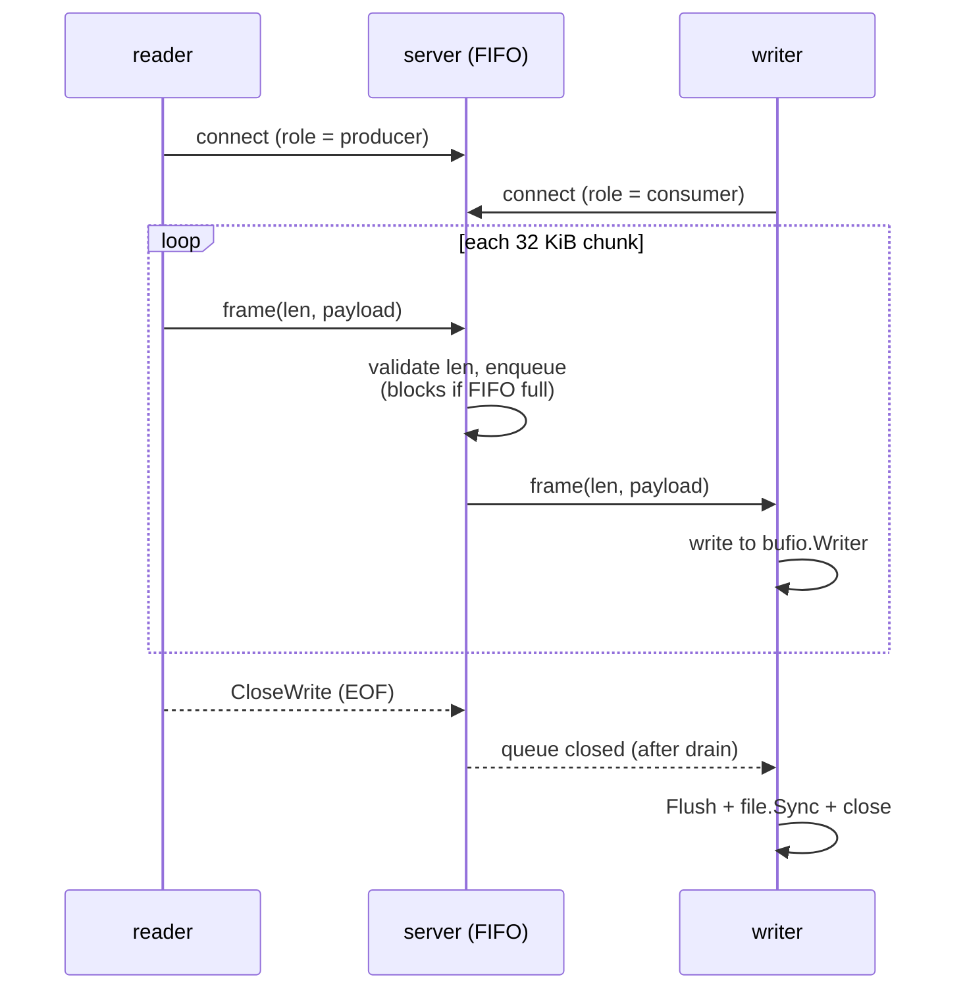
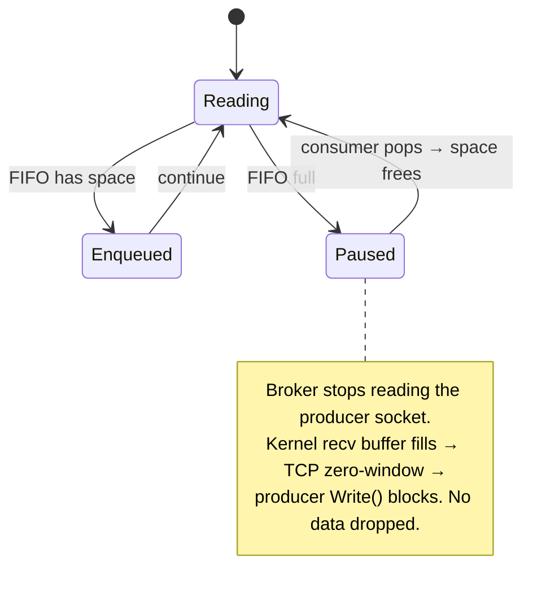

# Spec: `filequeue` — A Stdlib-Only Messaging System

> **Assignment:** Read lines from a file → push to a queue service over a network
> protocol → pop from the queue over the network → write to a file. Multiple
> asynchronous workers. Queue service uses **only the Go standard library**. An
> arbitrary ASCII file fed in must produce a **byte-identical** copy out.
>
> **Context:** Senior Platform Engineer, Audio Infrastructure @ Corti. The system
> is a toy, but the assignment is really a proxy for: *can you design a low-latency,
> fault-tolerant, memory-disciplined pipeline that a hospital or emergency-dispatch
> centre could trust?* This spec keeps the **core** small and buildable, and
> isolates Corti-grade ambition in a clearly-marked
> [Production Extensions](#11-production-extensions-corti-context) appendix so the
> two are never confused.

---

## 1. Objective

Build three cooperating processes connected by a custom TCP queue broker:

| Component | Role | Responsibility |
|-----------|------|----------------|
| **reader** | Producer worker | Stream an input file as length-prefixed frames to the broker. Never load the whole file into memory. |
| **server** | Queue broker | Accept frames over TCP, hold them in a bounded in-memory FIFO, hand them to the consumer in order. Stdlib only. |
| **writer** | Consumer worker | Pop frames from the broker and append their raw payload bytes to the output file, then `fsync`. |

**Success looks like:** for *any* ASCII input file `in`, after the pipeline runs,
`sha256sum in out` reports identical digests — including exact line terminators
(`\n`, `\r\n`), empty lines, and the presence or absence of a trailing newline.

### Acceptance criteria

1. `sha256sum` of input == output for: empty file, file with no trailing newline,
   file with `\r\n` terminators, file with very long lines (> 64 KiB), and a
   multi-gigabyte file.
2. Memory stays **flat** regardless of file size (streaming, not buffering).
3. No goroutine leaks, socket leaks, or unflushed data on clean shutdown.
4. `make run` builds, runs the full pipeline, and self-verifies with `diff`.

---

## 2. Tech Stack

- **Language:** Go 1.26 (`module filequeue`).
- **Dependencies:** **Go standard library only** — `net`, `bufio`, `os`,
  `os/signal`, `encoding/binary`, `io`, `sync`, `context`, `flag`, `log`.
  No third-party modules. `go.mod` must list zero `require`d external packages.
- **Transport:** raw TCP (`net` package). No HTTP / gRPC / JSON framing.

---

## 3. Architecture Overview

```
        PRODUCER                         BROKER                          CONSUMER
 ┌──────────────────────┐      ┌────────────────────────────┐     ┌──────────────────────┐
 │     reader (cmd)     │      │       server (cmd)         │     │     writer (cmd)     │
 │                      │      │                            │     │                      │
 │  os.Open(in)         │      │   net.Listen("tcp")        │     │   net.Dial("tcp")    │
 │       │              │      │        │                   │     │        ▲             │
 │  bufio.Reader        │      │   Accept() ──► conn        │     │   bufio.Writer       │
 │       │              │      │        │                   │     │        │             │
 │  chunk into 32 KiB   │ TLV  │   read frame ──► enqueue   │ TLV │   read frame ──►     │
 │  frame encoder ──────┼─────►│   ┌────────────────────┐   ├────►│   write payload      │
 │  (len ‖ payload)     │ TCP  │   │ bounded FIFO queue │   │ TCP │   to output file     │
 │                      │      │   │  (fixed capacity)  │   │     │        │             │
 │                      │      │   └────────────────────┘   │     │   file.Sync()        │
 └──────────────────────┘      │   dequeue ──► write frame  │     └──────────────────────┘
                               └────────────────────────────┘
        in  ──────────────────────────── identical bytes ──────────────────────────►  out
```

**Data-flow contract:** one ordered FIFO stream of opaque byte chunks. The broker
never interprets payload bytes — it only moves framed blobs in the order received.
A single reader and single writer per stream guarantees ordering for free.

### 3.1 Component view

```mermaid
flowchart LR
    subgraph P["reader — producer process"]
        F[("input file")] --> BR["bufio.Reader"]
        BR --> CH["chunk → 32 KiB"]
        CH --> ENC["WriteFrame(len ‖ payload)"]
    end
    subgraph B["server — broker process"]
        ACC["Accept loop"] --> RD["ReadFrame + validate len"]
        RD --> Q[["bounded FIFO (cap N)"]]
        Q --> WR["WriteFrame → consumer"]
    end
    subgraph C["writer — consumer process"]
        DEC["ReadFrame"] --> BW["bufio.Writer"]
        BW --> SY["Flush + file.Sync"]
        SY --> OF[("output file")]
    end
    ENC -- "TCP / length-prefixed" --> ACC
    WR -- "TCP / length-prefixed" --> DEC
```



### 3.2 Frame lifecycle (sequence)



### 3.3 Broker backpressure (state)



---

## 4. Wire Protocol — Length-Prefixed Frames Over Opaque Chunks

The key correctness decision. We do **not** use a text/line protocol (the original
`PUSH <msg>` / `POP` design cannot be byte-perfect: `bufio.Scanner` strips
terminators and a payload can never contain a newline). Instead we treat the input
as an **opaque byte stream** cut into fixed-size chunks, each wrapped in a frame.

### Frame layout

```
 0               1               2               3
 0 1 2 3 4 5 6 7 8 9 0 1 2 3 4 5 6 7 8 9 0 1 2 3 4 5 6 7 8 9 0 1
+---------------------------------------------------------------+
|                     Length (uint32, big-endian)               |
+---------------------------------------------------------------+
|                    Payload  (Length bytes, raw)               |
|                              ...                              |
+---------------------------------------------------------------+
```

| Field | Type | Size | Constraints |
|-------|------|------|-------------|
| Length | `uint32` big-endian | 4 B | `1 ≤ Length ≤ MaxFrameSize` (default 65535). |
| Payload | raw bytes | `Length` B | Opaque. Never parsed, never string-converted. |

- **End of stream:** signalled by the producer performing a TCP half-close
  (`CloseWrite`) after the last frame. The broker treats EOF on the read side as
  "no more frames from this producer". (A zero-length sentinel frame is reserved
  and rejected to keep length validation simple.)
- **Why chunks, not lines:** chunking the raw byte stream makes byte-identical
  output trivial and sidesteps every line-ending edge case. The reader *may* still
  read the file line-by-line for logging/metrics, but framing operates on bytes.

### Encode / decode rules

1. **Write:** `binary.BigEndian.PutUint32(hdr, len(payload))`, then write `hdr`
   followed by `payload`. Use a single buffered writer; flush at EOF.
2. **Read header:** `io.ReadFull(conn, hdr[:4])` — never assume one `Read` returns
   4 bytes.
3. **Validate:** if `Length == 0` or `Length > MaxFrameSize`, it is a **protocol
   violation** → drop the connection, log, do not allocate.
4. **Read payload:** `io.ReadFull(conn, buf[:Length])` into a pre-sized buffer.
5. **No conversions:** payloads stay `[]byte` end-to-end to avoid allocations and
   preserve exact bytes.

---

## 5. Broker (Queue Service) Design

- **Structure:** a **bounded FIFO** with fixed capacity `N` frames. The core
  implementation is a buffered channel (`chan frame`, cap `N`) — the simplest
  correct bounded queue in Go. (A pre-allocated ring buffer + `sync.Pool` is an
  *optimization*, documented in [§11](#11-production-extensions-corti-context),
  not required for correctness.)
- **Flat memory:** capacity is fixed at startup → memory is bounded and
  predictable regardless of file size. This is the cloud-billing lever: the broker
  reserves `N × MaxFrameSize` and never grows.
- **Backpressure (core):** when the FIFO is full, the broker stops reading from the
  producer socket. The kernel receive buffer fills, TCP advertises a smaller/zero
  window, and the producer's `Write()` blocks. Flow control is delegated to TCP —
  no unbounded in-broker buffering, no dropped data.
- **Ordering:** single producer → single FIFO → single consumer preserves order.
- **Shutdown:** on `SIGINT`/`SIGTERM`, stop accepting new connections, drain the
  FIFO to the connected consumer, then exit. No frame in the FIFO is dropped on a
  *clean* shutdown.

---

## 6. Worker Design

### reader (producer)

- `os.Open` the input; wrap in `bufio.Reader`.
- Loop: read up to `chunkSize` (default 32 KiB) bytes with `io.ReadFull` /
  `io.ReadAtLeast`; frame and write each non-empty chunk; on `io.EOF`, flush and
  `CloseWrite`.
- Streams the file — peak memory is one chunk + buffers, independent of file size.

### writer (consumer)

- `net.Dial` the broker; wrap the output file in `bufio.Writer`.
- Loop: read frame, write `payload` to the buffered file writer.
- On EOF/CLOSED from broker: `Flush()` then `file.Sync()` then close — guarantees
  the on-disk copy is complete before exit.

### Shared safety (core)

- **Panic isolation:** each connection-handling goroutine wraps its body in
  `defer func(){ recover() }()` and logs the stack, so one bad connection never
  takes down the broker's accept loop.
- **Deterministic cleanup:** `defer conn.Close()` / `defer f.Close()` on every
  resource; flush before close.
- **Socket deadlines — deferred:** rolling read/write deadlines are intentionally
  left out of the core because a deadline can abort a *legitimately* backpressured
  multi-GB transfer during a long, healthy stall. They belong with reconnection in
  the reliability extension ([§11.1](#111-reliability--recovery)).

---

## 7. Commands

```bash
# Build all three binaries into ./bin/
make build

# Run the full pipeline and self-verify (input == output via diff)
make run

# Run unit + integration tests
make test            # == go test ./...

# Remove binaries and generated output
make clean
```

Manual invocation:

```bash
bin/server -addr localhost:4000
bin/writer -addr localhost:4000 -out test/testdata/output.txt
bin/reader -addr localhost:4000 -in  test/testdata/sample.txt
```

---

## 8. Project Structure

```
go.mod                      → module filequeue (no external deps)
Makefile                    → build / run / test / clean targets
cmd/
  server/main.go            → broker entrypoint (listen, accept, drain, signals)
  reader/main.go            → producer entrypoint (open file, frame, send)
  writer/main.go            → consumer entrypoint (recv, write, fsync)
internal/
  queue/                    → bounded FIFO broker (stdlib only)
  wire/                     → frame encode/decode (len-prefix, validation)
test/
  testdata/                 → sample inputs + generated outputs
  *_test.go                 → integration tests (round-trip fidelity)
docs/
  specifications.md         → this spec
  role/                     → role + assignment reference
```

---

## 9. Code Style

Idiomatic Go: small packages, explicit error returns, `[]byte` over `string` on
the hot path, no premature abstraction.

```go
// WriteFrame writes a single length-prefixed frame. The payload is opaque; it is
// never inspected or copied beyond the framing itself.
func WriteFrame(w io.Writer, payload []byte) error {
	if len(payload) == 0 || len(payload) > MaxFrameSize {
		return fmt.Errorf("wire: payload length %d out of range", len(payload))
	}
	var hdr [4]byte
	binary.BigEndian.PutUint32(hdr[:], uint32(len(payload)))
	if _, err := w.Write(hdr[:]); err != nil {
		return err
	}
	_, err := w.Write(payload)
	return err
}
```

Conventions:
- Exported identifiers documented with a leading comment naming the identifier.
- Errors wrapped with `%w` and package-prefixed context (`wire:`, `queue:`).
- No `panic` for control flow; `recover` only at goroutine boundaries.
- `gofmt` / `go vet` clean. No naked returns on non-trivial functions.

---

## 10. Testing Strategy

- **Framework:** stdlib `testing` + `testing/quick` for fuzz-style fidelity.
- **Location:** unit tests beside code (`internal/wire/wire_test.go`); end-to-end
  round-trip tests under `test/`.
- **Levels:**

  | Concern | Test |
  |---------|------|
  | Frame encode/decode round-trips | unit, table-driven + `testing/quick` |
  | Length validation rejects 0 / > max | unit |
  | Byte-perfect file copy | integration: spin up broker on `:0`, run reader+writer, `sha256` compare |
  | Edge cases | empty file, no trailing `\n`, `\r\n`, line > 64 KiB, binary-ish bytes |
  | Backpressure / slow consumer | integration: throttle writer, assert flat memory, no loss |
  | Graceful shutdown | send `SIGTERM` mid-stream, assert drained + fsynced |

- **Memory proof:** `go test -run RoundTrip -benchmem` and an optional
  `pprof` heap profile over a synthetic multi-GB stream showing a flat curve.
- **Coverage target:** ≥ 80% on `internal/wire` and `internal/queue`.

---

## 11. Production Extensions (Corti Context)

> Everything above is the **buildable core**. The items below are *not* required to
> pass the assignment; they are what I would add to run this in Corti's
> emergency-dispatch / hospital environment, with the trade-offs stated honestly so
> we don't over-build a 4-hour exercise.

### 11.1 Reliability & recovery

- **Reconnection with backoff:** workers reconnect on transient drops using
  exponential backoff + jitter (100 ms → 5 s cap) to avoid thundering-herd. The
  reader only advances its file offset after the broker acknowledges a frame, so a
  reconnect resumes without loss or duplication.
- **Write-ahead log (WAL):** the broker appends `len‖payload` to a sequential file
  before enqueuing, and `fsync`s on a clean shutdown. On boot it replays
  unacknowledged frames, then opens its port. Cost: extra disk I/O and code; gains
  durability across broker eviction. *Deliberately out of the core* because the
  assignment's queue is in-memory by construction.
- **Acknowledgements:** an explicit per-frame ACK turns the pipeline from
  at-most-once into at-least-once; combined with an idempotent writer offset it
  approaches exactly-once for the file-copy use case.

### 11.2 Emergency / real-time audio nuance

- For a **stored file**, blocking backpressure (slowing the reader) is correct and
  lossless — that is the core behaviour.
- For a **live emergency call**, you cannot back-pressure a human. The production
  design switches to a **load-shedding** policy: never block ingestion; instead
  shed *secondary* analytics (e.g. live sentiment) first, then degrade
  *non-critical* data, and spool the raw audio to a volatile failover buffer or
  fast scratch disk so the patient's record is preserved. The framing and broker
  stay the same; only the full-queue policy (block vs. shed) changes, selected by
  config.

### 11.3 Scaling — multiple concurrent streams

The core copies **one** file (one reader → one FIFO → one writer). Running many
independent reader→writer pairs through one broker at once (e.g. one stream per
phone call, 100k+ calls/day) requires three additions, because a single shared
FIFO would **interleave** frames from different producers and corrupt every output:

1. **Identity** — extend the frame header with a `StreamID` so each frame is
   attributable to a stream.
2. **Routing** — the broker becomes a `map[StreamID]*queue` instead of a single
   `*queue`; frames are sorted into the queue for their stream.
3. **Rendezvous** — a consumer subscribes by `StreamID` (sent on connect) so the
   broker pairs it with the matching producer's queue.

This is the Kafka *topic/partition* model: each call is a partition, and a broker
fleet shards partitions across machines via consistent hashing. Stateless framing
means brokers scale horizontally by partition; a per-partition WAL gives recovery.

**Design constraint honoured in the core:** connection handling is written so no
global mutable state assumes a single stream, making the `StreamID` + routing-map
change purely additive rather than a rewrite.

### 11.4 Cost / cloud billing

- Fixed-capacity broker (`N × MaxFrameSize`) gives a **flat, predictable memory
  footprint** → right-size the instance, no autoscaling surprises.
- `sync.Pool` + a pre-allocated ring buffer eliminate per-frame GC churn at high
  throughput, lowering CPU and letting smaller instances carry more streams.

### 11.5 Observability & hardening

- Structured logs + counters (frames in/out, queue depth, drops, reconnects),
  exposed via an optional `net/http/pprof` and `expvar` endpoint (stdlib).
- Strict `MaxFrameSize` validation already guards against malformed-length memory
  attacks; add per-connection rate limits and read timeouts at the edge.

---

## 12. Boundaries

- **Always:** stream (never load whole files); validate frame length before
  allocating; flush + `fsync` before exit; `gofmt`/`go vet` clean; run `make test`
  before commit.
- **Ask first:** adding any third-party dependency (default answer is **no** — the
  assignment forbids it); changing the wire format; introducing the WAL into the
  core; changing the chunk size or `MaxFrameSize` defaults.
- **Never:** parse or mutate payload bytes; use a text/line protocol that loses
  terminators; drop frames silently on a clean shutdown; commit generated
  `output.txt` or `*.wal` files; swallow a `recover`ed panic without logging.

---

## 13. Success Criteria (testable)

- [ ] `make run` exits 0 and prints "output matches input".
- [ ] `sha256sum` equal for all edge-case inputs in [§10](#10-testing-strategy).
- [ ] `go.mod` has zero external `require`s.
- [ ] Memory flat (within noise) across 1 MB → multi-GB inputs.
- [ ] `SIGTERM` mid-stream leaves a complete, fsynced partial output with no panic.
- [ ] No leaked goroutines/sockets (`go test -race` clean).

---

## 14. Open Questions

1. ~~**Multiple concurrent streams**~~ — **Resolved.** Core is strictly one reader /
   one writer per run. Multi-stream (StreamID + routing map + subscribe-by-ID) is a
   documented additive extension; see [§11.3](#113-scaling--multiple-concurrent-streams).
   Broker connection handling avoids single-stream global state so the extension
   stays additive.
2. **Chunk size default** — 32 KiB balances syscall count vs. latency; confirm if a
   different target matters for the demo.
3. Should the **core** demonstrate reconnection (11.1) for the interview, or is the
   written extension sufficient? (Recommend: keep core simple, discuss live.)
